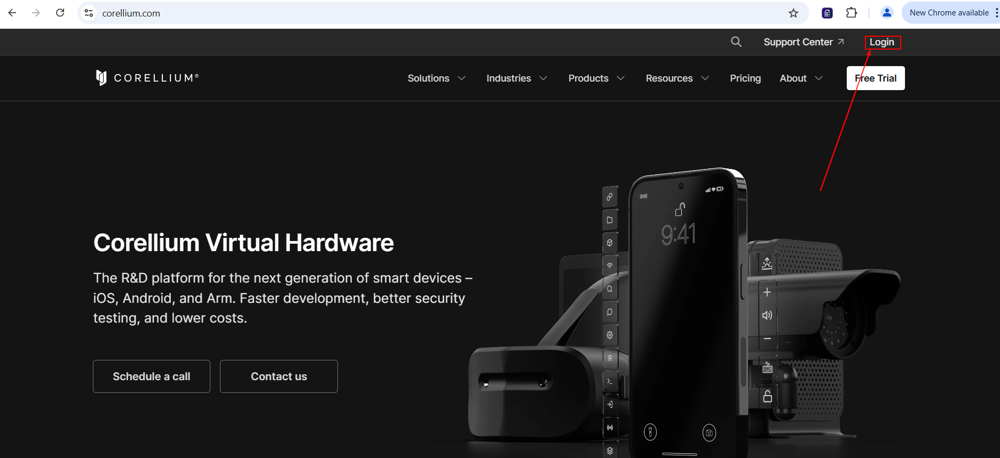
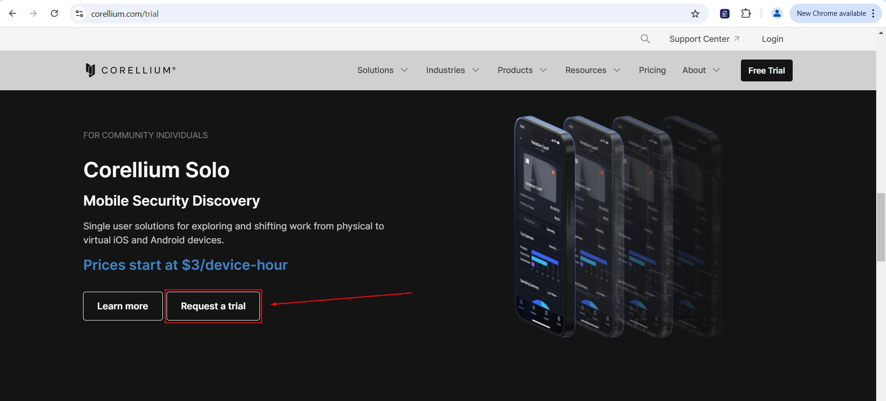

# Setting Up your Corellium Account
Before we get started with these labs, you will need to set up an account with Corellium.

Follow these steps to get ready:

1. In a browser of your choice, navigate to https://www.corellium.com

2. Next, login to your Corellium account by clicking the button in the top right:

**Note:** If you do not have an existing Corellium account, you will need to request a trial by going to https://www.corellium.com/trial then scrolling down until you see this:

3. Once you get logged in to Corellium, you can continue on to 