# Setting up Corellium and Establishing Remote Connections
Corellium URL: https://app.corellium.com/login

>[!WARNING]
>
> I CANNOT STRESS THIS ENOUGH!!!!!!
>
>REMEMBER TO <b style="color:#FF0000;">POWER OFF YOUR CORELLIUM DEVICE</b> WHEN NOT WORKING ON LABS!!!!
>
><b style="color:#FF0000;">CORELLIUM WILL CHARGE YOU!!!!!</b>

## Creating an Android Device in Corellium
Login to your Corellium account and select the **DEVICES** tab and click **CREATE DEVICE**.

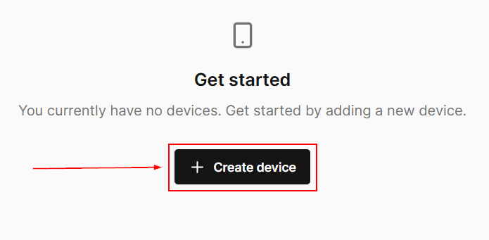

Next, select "Default Project."

Next, select **ANDROID -> Generic Android** and select it.

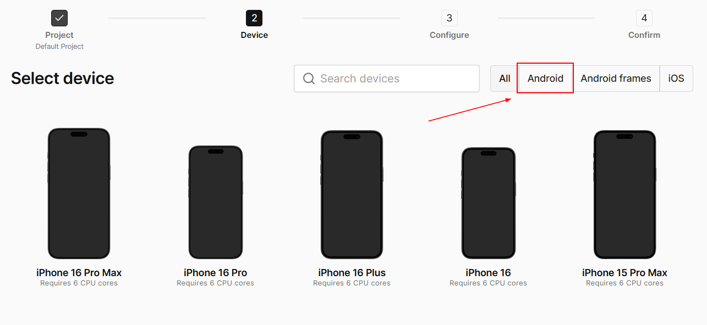

Select the firmware package, **12.0.0 (Build r26 userdebug)**, from the dropdown menu and click **SELECT**.

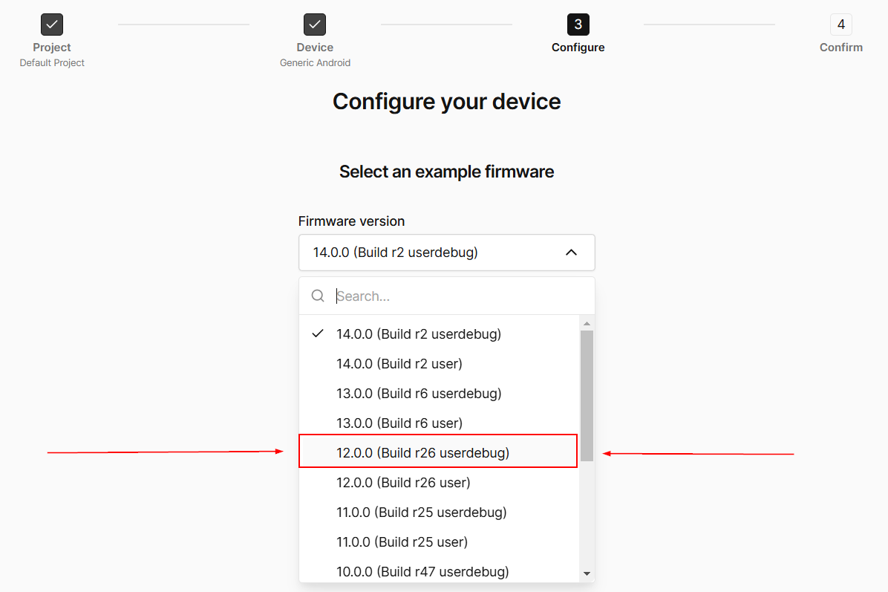

Leave the checkbox unchecked and select **CREATE DEVICE**

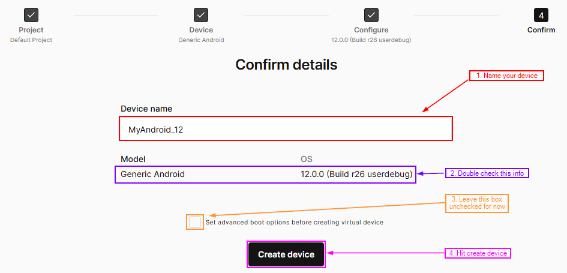

Corellium will then proceed to create the virtual deivce. 

Once the build is complete, you should have a virtual Android device with menu options as shown below.

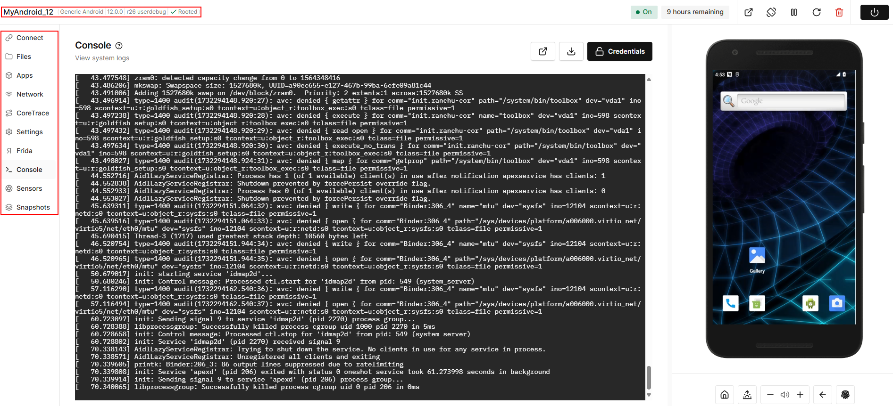

>[!Note]
>If it does not say "Rooted" next to the device name, it is because you did not select userdebug firmware. Please click the trash icon in the upper right, delete the device and start over from the beginning.

## Navigating Menu Items in Corellium ##

The menu items associated with your Android device should look like the following.

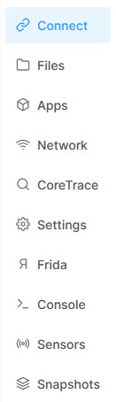

The following list contains a high-level description of each menu item.
 * **Connect** - This feature allows the tester to remotely connect to the virtual Android device for testing. 
 * **Files** – Corellium gives you control over the device filesystem, allowing you to upload, download, delete, modify, and search for files.
 * **Apps** – Manage Apps installed on the virtual device (i.e., install/uninstall, launch/kill apps).
 * **Network** – The Network Monitor captures, presents, and monitors HTTPS traffic, transparently defeating certificate pinning.  
 * **CoreTrace** - Ability to trace system calls for dynamic analysis and reverse engineering which offers a quick way to understand a program’s behavior. 
 * **Settings** - Configuration settings for your virtual device, such as: number of CPU cores, allocated RAM, as well as custom boot and kernel options.  
 * **Frida** - Corellium's bulit-in Frida server to support process hooking and code injection for bypassing controls and/or reverse engineering purposes.
 * **Console** – Use the Console option to see system and kernel logs and quickly run commands without needing to connect over ADB or SSH.
 * **Sensors** - Configure your virtual device's peripherals and sensors, such as: Battery status, Camera/Microphone, GPS coordinates, and Motion/Position/Orientation.
 * **Snapshots** - Save, clone, or restore your device's virtual state. 

## Remotely Connecting to your Virtual Mobile Device ##

Establishing a network connection between your mobile device and your testing platform is required to perform actions such as proxying and intercepting Internet traffic, which enables security practitioners to further evaluate a given mobile application under an active/running state. Additionally, tools like the Android Debugger (adb) can be leveraged remotely from the tester’s virtual machine to the virtual mobile device running in Corellium. 
In this section we will cover two options for establishing remote network capabilities to/from your MobileApp Virtual Machine and the virtual mobile device running in Corellium: SSH and VPN.

### SSH ###
1. Create a unique SSH keypair (public and private certificates) from your MobileApp VM:
    - From the command prompt, type the following command and hit enter.

    <pre>ssh-keygen -t ed25519</pre>

    - For the file name, enter “sshKey”, then hit enter.
    - Hit enter two more times to create the key with no passphrase.
    - The keypair should now be in your CWD (current working directory – to confirm, type the command ‘ls’ and you should see two files
        - sshKey – this is your private key and should remain on your MobileApp VM.
        - sshKey.pub – this is your public certificate, the contents of which will need to be added to your Corellium instance.

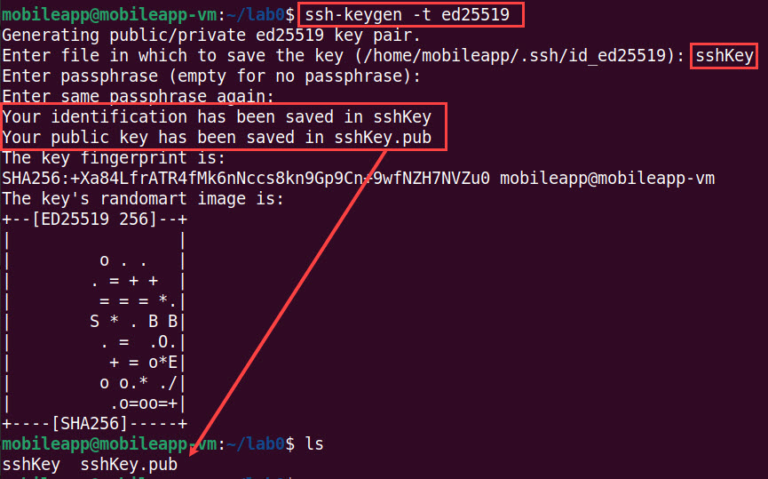

2. Type the following command to display the contents of sshKey.pub to stdout of your terminal.

<pre>cat sshKey.pub</pre>

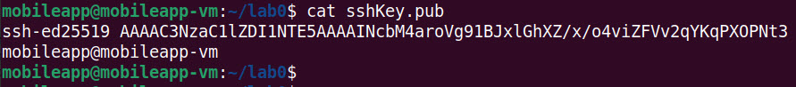

3. From your Corellium account select "Connect". Then select Admin page at the bottom red box of the "Quick Connect" section.
   
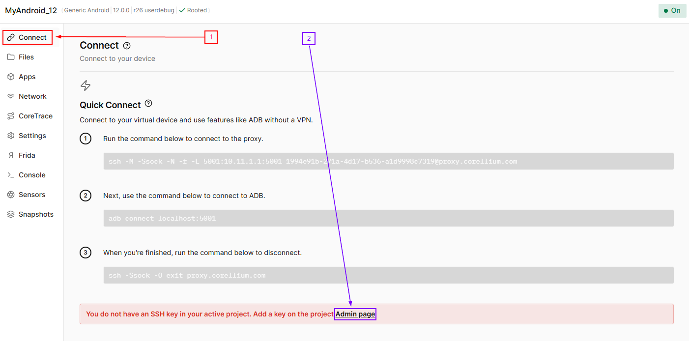

>[!Note]
>If you get a white screen after clicking "Admin Page", just reload your browser!

Now, click on "Default Project" to expand:

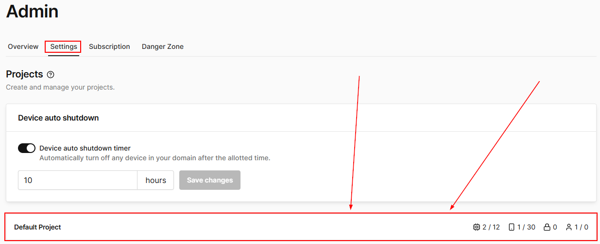

5. Under the **Authorized Keys** section, click **NEW KEY**, then select **SSH** for the *Key Type*, and copy the contents of your ssh public key (step 2 above) and paste it in the text box here. Click **CREATE**.

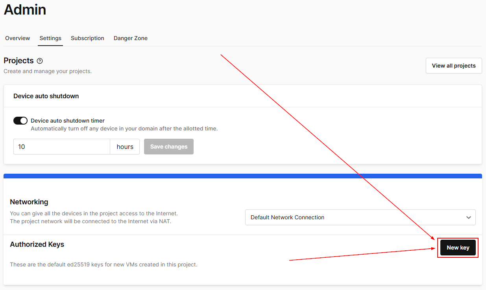

>[!Note]
>Be sure to add the entire contents of your public key - starting with *"ssh-ed25519..."* and ending with your hostname *"...mobileapp@mobileapp-vm"*. The full content of your SSH key will be different.

#### Test the SSH Connection ####

1. Navigate back to the devices tab, then ensure that your Corellium virtual device is powered on.

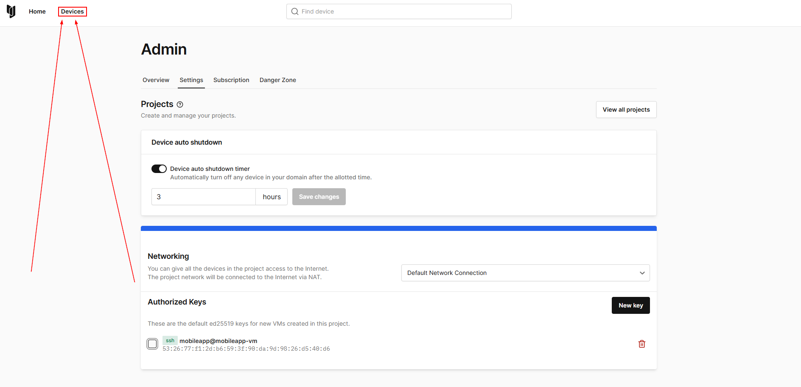

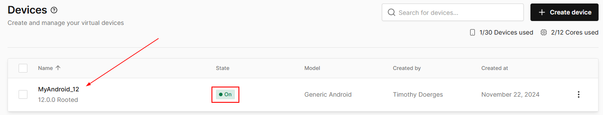

2. Navigate to the **Connect** menu item and copy the first command listed under **Quick Connect**.

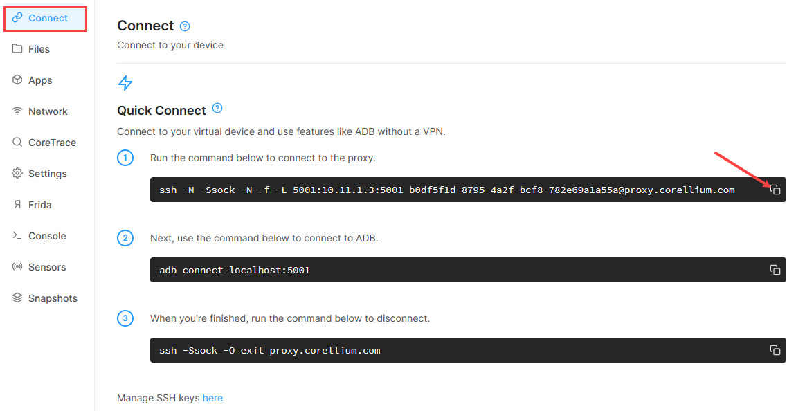

3. Return to your MobileApp VM, then paste the command into a terminal session. The command will be slightly different for each student; however, be sure to add the `-i sshKey` at the end of the command you just pasted.

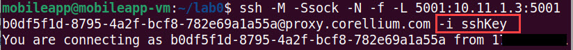

4. The above command will create an SSH tunnel between your MobileApp VM and the virtual device in Corellium. The command also sets a *control socket* and binds the connection to `localhost:5001`. Now we can connect the Android Debug Bridge (adb) using the following command.

<pre>adb connect localhost:5001</pre>

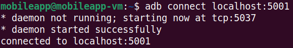

5. With `adb` connected, we can run commands such as: 

`adb devices` - List of devices attached

`adb shell` - Shell acess to the Android device

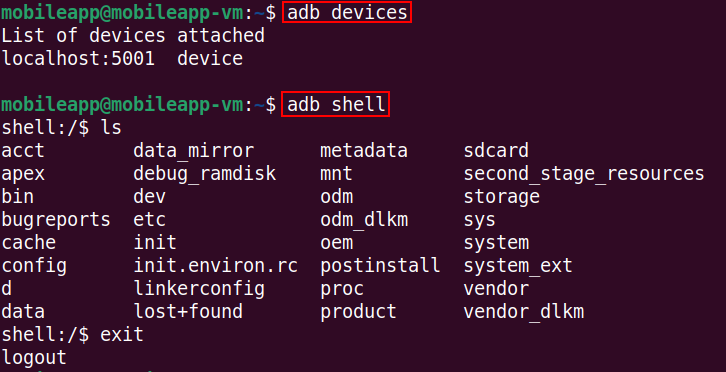

**NOTE:** There's a dedicated [lab](https://github.com/deruke/AndroidLabs/blob/main/Labs/adb/adb_cheatsheet/adb_cheatsheet.md) on utilizing adb and adb commands.

6. Finally, to terminate the SSH tunnel run the following command.

`ssh -Ssock -O exit proxy.corellium.com`

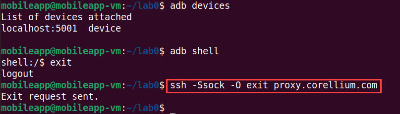

## VPN ##

An alternative approach to SSH for remote connectivity is to use a VPN. Corellium offers support for VPN connections via an OpenVPN configuration which is obtained via the Corellium web UI. The Corellium VPN enables us to remotely route network traffic from the virtual mobile device, through our MobileApp VM. From the MobileApp VM, we can then perform network traffic inspection and intercept/manipulate the traffic using tools like Burp Suite.

1.	To begin, navigate back to the Corellium web UI and access your virtual mobile device. Then click on the **Connect** tab.

>[!Note]
>Ensure that your virtual device is powered on.

2. Scroll down to the **Connect via VPN** section and click **DOWNLOAD OVPN FILE**.

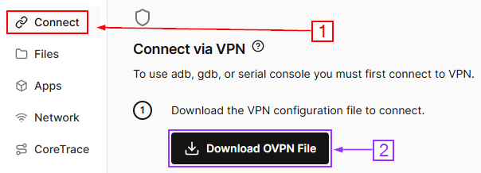

3. Save the downloaded OVPN file to a directory/location on the MobileApp VM.

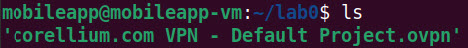

4. Prior to establishing the VPN, run the following command from a terminal session on your MobileApp VM to get a current list of network interfaces.

<pre>ip a</pre>

 - The following screen capture provides an example of the list of network interfaces.

 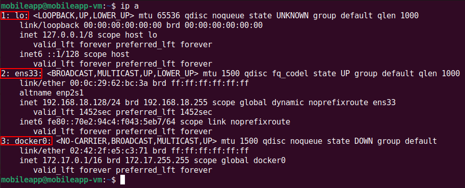

**NOTE**: Your output may not match exactly – the key takeaway here is understanding the current existing network interfaces prior to establishing the VPN.

5. Next, run the following command from a terminal session on your MobileApp VM.

<pre>sudo openvpn ~/Downloads/corellium.com\ VPN\ -\ Default\ Project.ovpn</pre>

When prompted to enter the password for mobileapp, do so.

 - We can see from the below output that OpenVPN created a new network interface, **tap0**, with the IP address: **10.11.3.2**

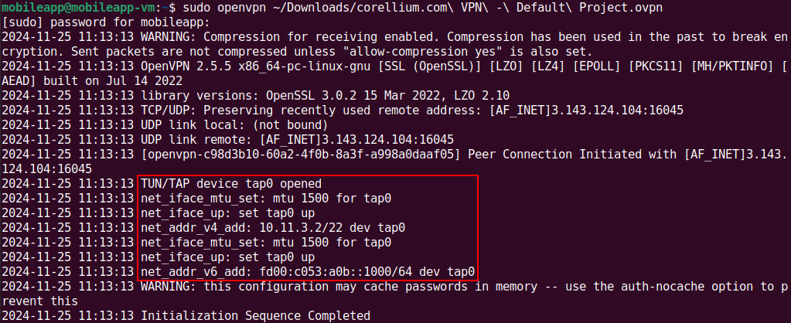

>[!Note]
>The IP address assigned to the tap0 interface may be different. 
><ins>Additionally, each time the VPN is established there is a possibility that the assigned IP may change</ins>.

6. Run the `ip a` command once again from a different terminal to see the tap0 interface and the currently assigned IP address.

<pre>ip a</pre>

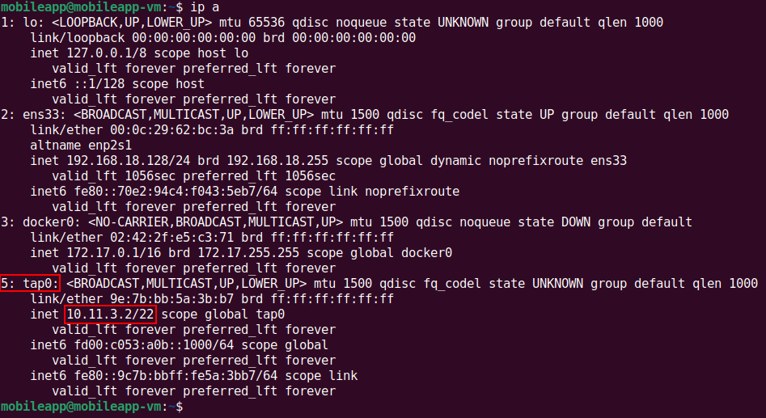

Take note of the tap0 IP Address. You will need it for the next command.

7. Test the VPN connection by navigating back to Corellium’s web UI and selecting the **Console** tab. Then enter the following command in the console shell.

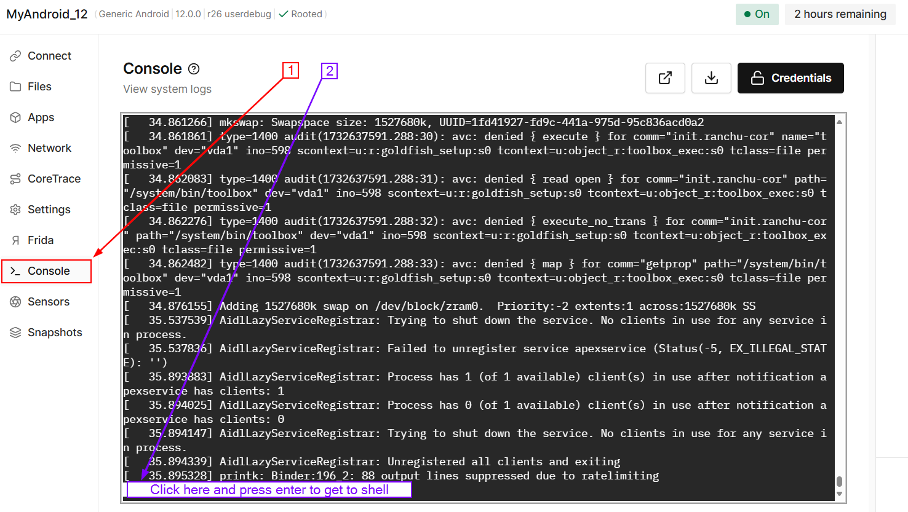

Once you get to the shell, run the following:
<pre>ping [tap0 assigned IP]</pre>

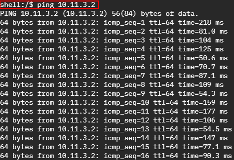

8. While the ping command is running in the console session, return to the MobileApp VM and execute the following *tcpdump* command:

<pre>sudo tcpdump -nni tap0</pre>

 - In the screen capture below, we can see that the virtual mobile device (10.11.0.3) and our MobileApp VM (10.11.3.2) are communicating over a private network connection.

 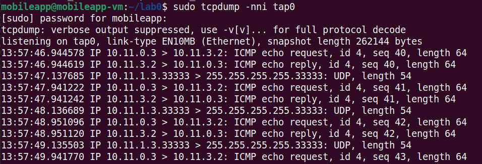

 When you are finished, you can press `ctrl + c` in both the MobileApp VM and the Corellium console to stop the processes for running.

***                                                                 

<b><i>Continuing the course?  [Next Lab](/Labs/LAB_01_adb_basics/adb_cheatsheet.md)</i></b>

<b><i>Want to go back?  [Previous Lab](/Labs/Corellium_Account_Creation/corelliumaccount.md)</i></b>

<b><i>Looking for a different lab?  [Lab Directory](/navigation.md)</i></b>

