# Become an `adb` Ninja #

>[!WARNING]
>
> I CANNOT STRESS THIS ENOUGH!!!!!!
>
>REMEMBER TO <b style="color:#FF0000;">POWER OFF YOUR CORELLIUM DEVICE</b> WHEN NOT WORKING ON LABS!!!!
>
><b style="color:#FF0000;">CORELLIUM WILL CHARGE YOU!!!!!</b>

This lab will familiarize you with a mobile app testing tool that is indispensible for Android testing: the Android Debug Bridge (adb). 

In this lab, you will utilize some of the most common features of adb such as gaining shell access to an Android device, moving files, installing APKs, and monitoring the system logger.

The first step will be connecting to your Android device in Correllium with adb. If you have a local Android device (i.e. plugged directly into your testing system), you generally don't need to perform this step. However, since our Android device is hosted in the cloud, we'll need to take advantage of adb's TCP connection feature to remotely access the device.

Before getting started, let's turn on our Corellium Android device:

Next, open a terminal window within the MobileApp VM. Run the following command to connect to the Android device:

<pre>ssh -M -Ssock -N -f -L 5001:[Your Device Address]:5001 [Your Device ID]@proxy.corellium.com -i ~/.ssh/id_rsa/sshKey</pre>

>[!Note]
>You will have a unique device address and ID.

Your unique version of the command can be copied here:

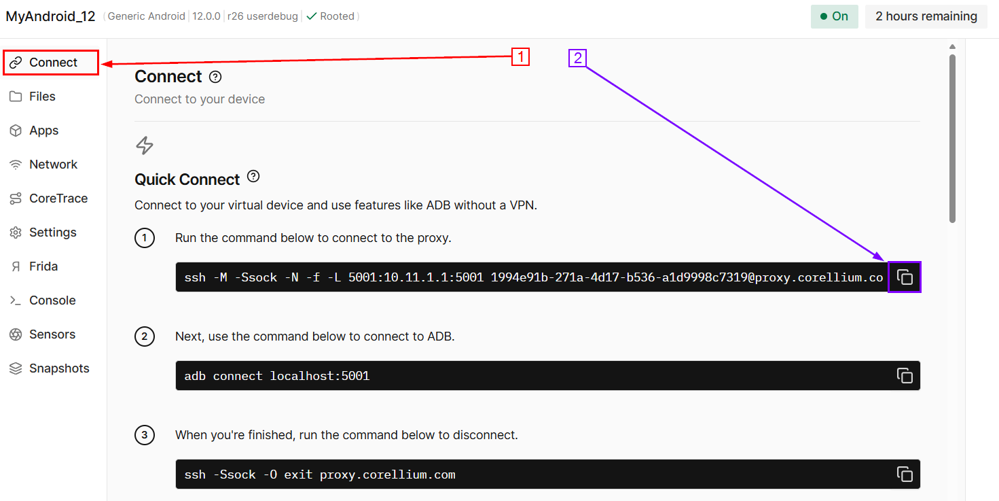

Paste that command into your VM terminal and run it. Be sure to add `-i ~/.ssh/id_rsa/sshKey` to the end of the command.

You will see the following:

Once connected, Run the following command in a terminal to ensure that your SSH tunnel is up:

<pre>netstat -lntp | grep ssh</pre>

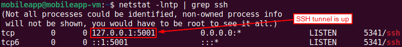

After verifying that your SSH tunnel is up, connect to your Android device with adb's connect command:

<pre>adb connect localhost:5001</pre>

Upon establishing the connection, you should see the message, "connected to localhost:5001"

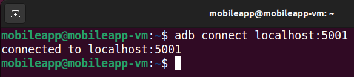

To verify access to your Android device, use adb's devices command.

<pre>adb devices</pre>

With adb connection, you can gain an interactive shell on the device by running the following commands: 

<pre>
adb shell
su
id
</pre>

This is useful if you're just starting to explore the app and you're not quite sure what you're looking for yet.

Go ahead and enter `exit` twice to leave the shell.

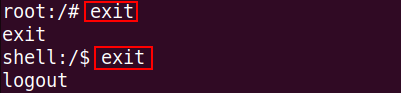

If you already know exactly what you're looking for, you can also use adb's shell command to run commands interactively, even to pipe output to your local testing system. For example, maybe you're researching the security of Android's KeyChain. The following command will run on the Android device and pipe the output to your local VM. 

<pre>adb shell pm list packages | grep key</pre>

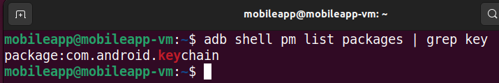

When penetration testing mobile apps, it is possible that you will receive the APK files outside of the Google Play store, as a stand-alone APK file. In which case, you will likely use adb to install the app. This is easily accomplished with adb's install command. After installing the app, you can use adb shell to find the package name after the APK is installed.

***
# Installing third-party apps

Let's play with a third-party app called F-Droid.  Often times you will be given a .apk file to test.  This will walk through how to install those apps outside of the Google Play Store.

First, let's download it.

<pre>
wget https://f-droid.org/F-Droid.apk
</pre>

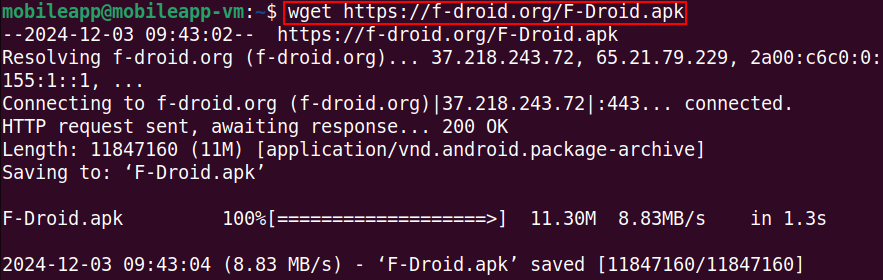

Next, let's install it.

<pre>
adb install F-Droid.apk
</pre>

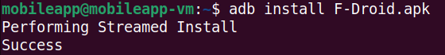

If the app you are testing is from the Google Play store, then you will want to extract the APK from the device after installing the app. This will allow you to conduct static analysis of the app. To do so, you need to find out the name of the package and the full file path where the APK file is saved to.

To find the package name, use Android's package manager utility, `pm`, to list all of the package names and pipe the output to `grep` in order to search for the package that you are testing.

<pre>adb shell pm list packages | grep fdroid</pre>

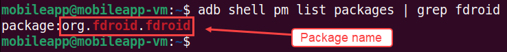

Use `pm` again, with the package name, to find the full path to the APK.

<pre>adb shell pm path org.fdroid.fdroid</pre>

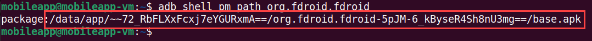

Note: The path to the package will be different than what you see here. Each time an APK is installed, the directory path is randomly generated. As a demonstration of this, see the following screenshot where the app has been uninstalled and re-installed. 

Notice how the file paths change.

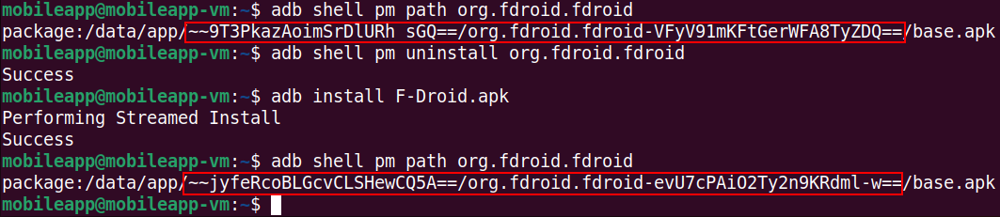

The official explanation for the name / reason why the name is dynamic is becasue they hate you.

That long, messy string is the full file path that we will use to copy the APK file from the device, with adb's `pull` command. Let's run the following:

<pre>
adb pull /data/app/~~jyfeRcoBLGcvCLSHewCQ5A==/org.fdroid.fdroid-evU7cPAiO2Ty2n9KRdml-w==/base.apk
</pre>

Note: to make this easier, you can highlight, right click and copy the directory path for this command!

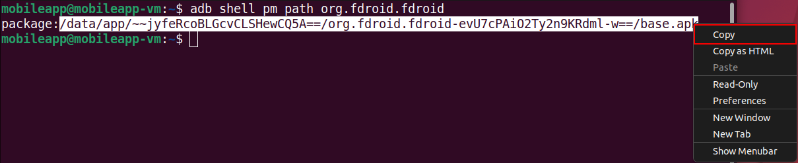

There will likely be ocassions where you need to copy a file from your testing system to the Andrdoid device. For this situation, you can use adb's `push` command. When copying to a device, be mindful of where you are copying to. Due to Android's file system permissioning, you might accidentally try to copy to a read-only location. 

A common location to copy files to is the `/sdcard/Download/` directory which does not require root access. 

In the figure below, I created an example text document containing the classic phrase "Hello World!". Note how I attempted to copy it to the `/tmp` directory and received an error in response. While the error states that it is a "Read-only file system", the `/tmp` directory actually does not exist on Android by default.

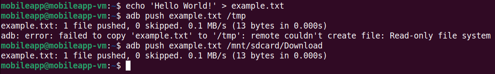

A common testing technique for mobile testing is to determine if sensitive information is being sent to the system logger. The developer may have accidentally left a misplaced debug statement or perhaps the threat of leaking sensitive information in the log was not considered during development. adb's `logcat` command can be used to stream the system logger.

When adb's `logcat` is ran without any arguments, it will print literally everything, which can make conducting meaningful analysis nearly impossible. When testing a mobile app, you will likely want to filter logcat's output. There are a few ways you can filter logcat's output.

One way is to use some of logcat's built in filter mechanisms which will filter depending on the log type (e.g. error, informational, debug, all ,etc.). Another way to filter logcat's output is by the package name as this will likely correspond to the process name. This is the method we are going to use. Let's run the following command:

<pre>adb logcat | grep fdroid</pre>

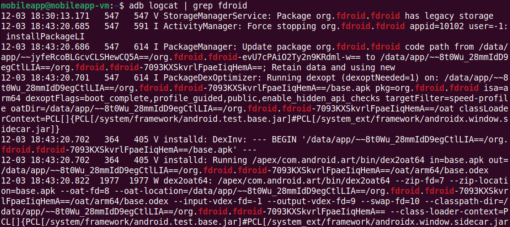

You can use `ctrl + c` in order to get back to the prompt.

If you think that the app might be spawning new processes or making inter-process communication (IPC) calls, it might be worthwhile to filter by the process ID (PID) associated with the app that you're testing. To do do, you can use the `ps` command to find the PID assocaited with the app you're testing and use that as a filter for logcat.

Reminder: Your PID will very likely be different than what is shown below.

<pre>
adb shell ps | head -n 1
adb shell ps | grep fdroid
adb logcat | grep 2783
</pre>

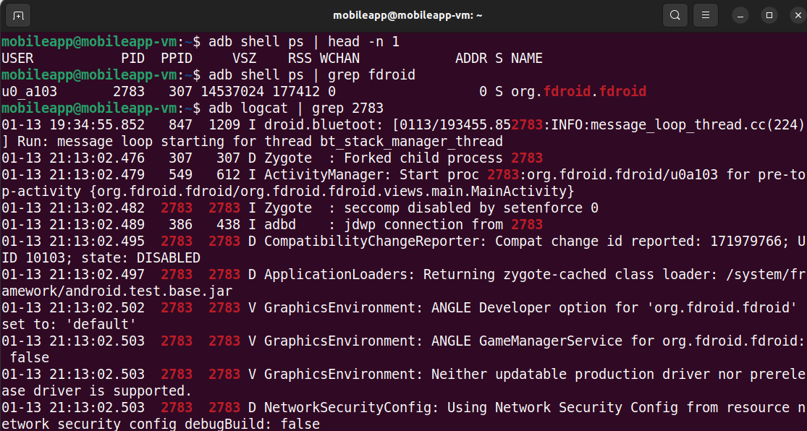
