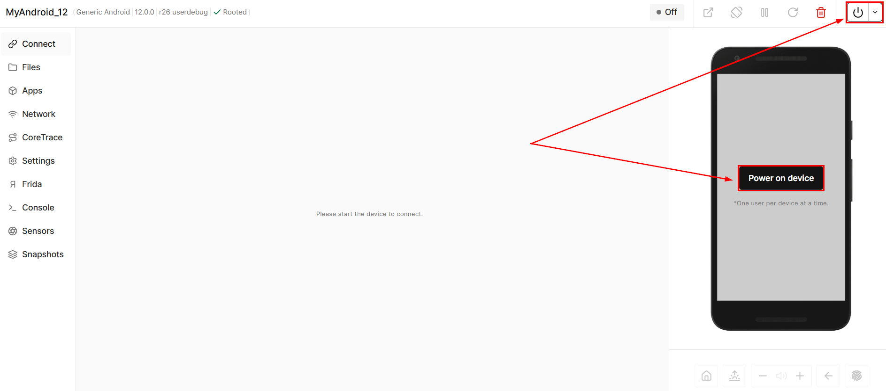
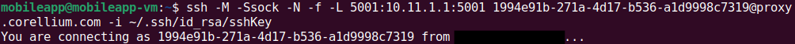
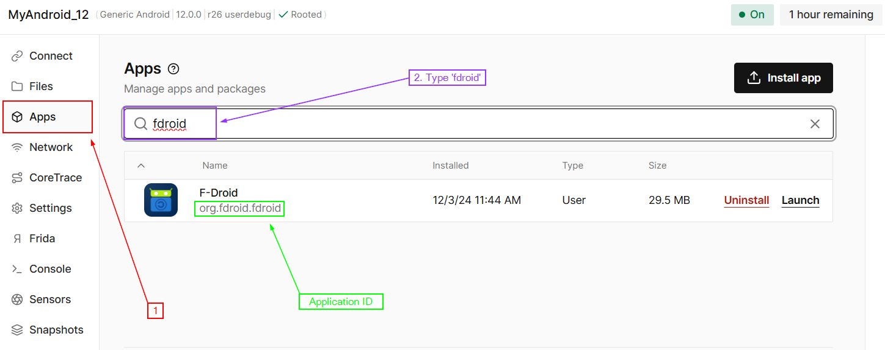
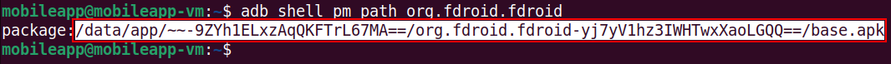
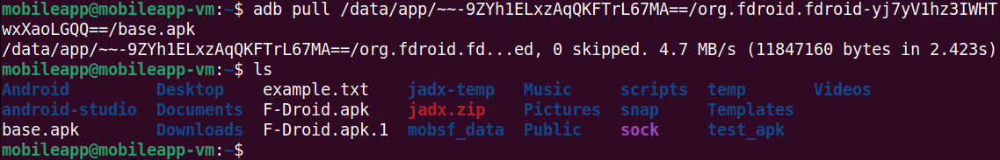
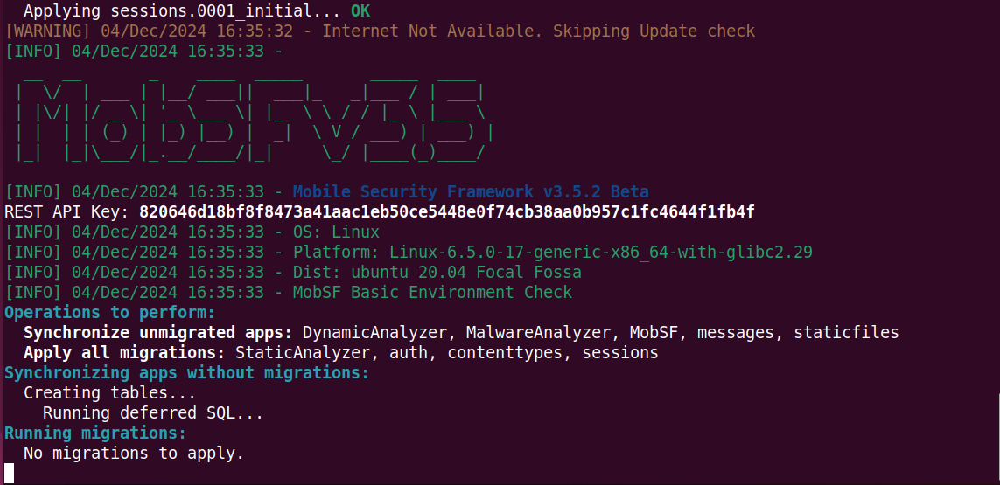
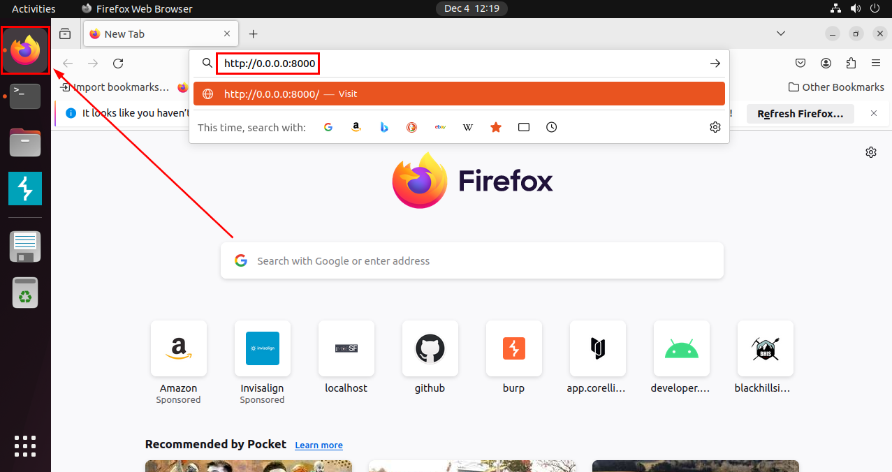
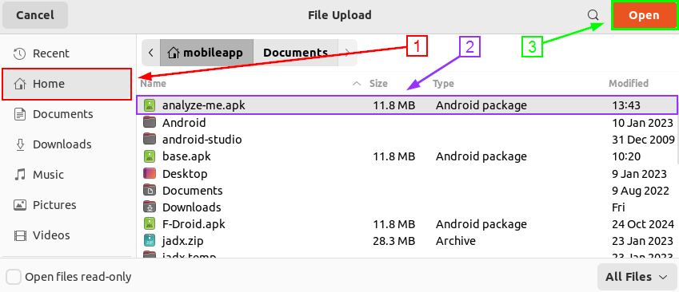
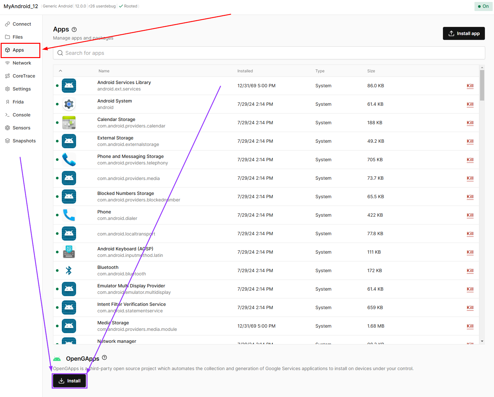

# Extracting an APK for static analysis

I CANNOT STRESS THIS ENOUGH!!!!!!

REMEMBER TO <b style="color:red;">POWER OFF YOUR CORELLIUM DEVICE</b> WHEN NOT WORKING ON LABS!!!!

<b style="color:red;">CORELLIUM WILL CHARGE YOU!!!!!</b>

***

Before getting started, lets turn on our Corellium Android device:

Next, open a terminal window within the MobileApp VM. Run the following command to connect to the Android device:

<pre>ssh -M -Ssock -N -f -L 5001:[Your Device Address]:5001 [Your Device ID]@proxy.corellium.com -i ~/.ssh/id_rsa/sshKey</pre>

**Note:** You will have a unique device address and ID.

Your version of the command can be copied here:

Paste that command into your VM terminal and run it. Be sure to add `-i ~/.ssh/id_rsa/sshKey` to the end of the command.

You will see the following:

Now run the following to connect to the local host:

<pre>adb connect localhost:5001</pre>

## Downloading the APK

Now that we are connected, the first thing you will need is the application ID of the app we are testing. We will be analyzing F-Droid. On the Corellium interface click on the “Apps” tab and start typing the name of the application. The application ID is found directly under the application name as shown below. 

To download the APK from the device you will need the applications full path. To get it,  run the following command:

<pre>adb shell pm path org.fdroid.fdroid</pre>

Copy the line in the output that ends in `base.apk` as shown below:

Next, run the final command:

<pre>adb pull [PATH_TO_APP] [OUTFILE_NAME]</pre>

## Running MobSF

[MobSF](https://mobsf.github.io/docs/#/) is already installed on your VM. To run the docker container, run this command:

<pre>sudo docker run -it --rm -p 8000:8000 opensecurity/mobile-security-framework-mobsf:latest</pre>

Enter the VM password if/when prompted.

Now navigate to http://0.0.0.0:8000 in your VM web browser.

Once loaded, go ahead and click "Upload and Analyze", and upload an APK file. 

Processing the APK file will take a while, so let that keep running in the background as we will use it for future labs.

## Analyzing Other Apps
You can also test out any app youd like from the Play Store. To do this you will need to install `OpenGApps`. This will give you access to the Google Play Store. This can be done from the "Apps" tab in Corellium.

**Note: You will need to log-in with a Google account before you can download any apps**

Then you can simply install apps from the Play Store as you normally would.
