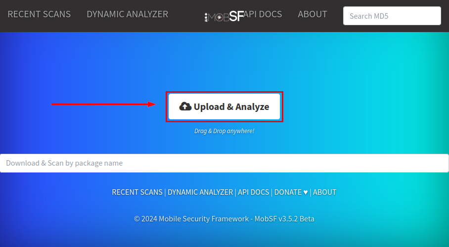
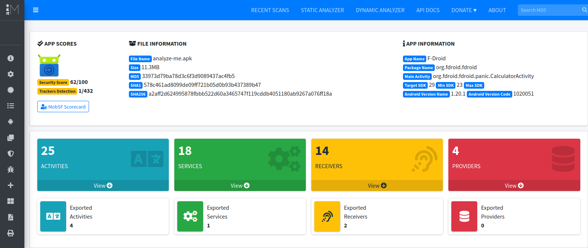
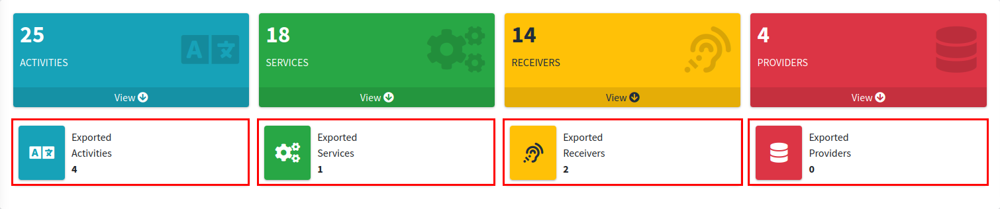
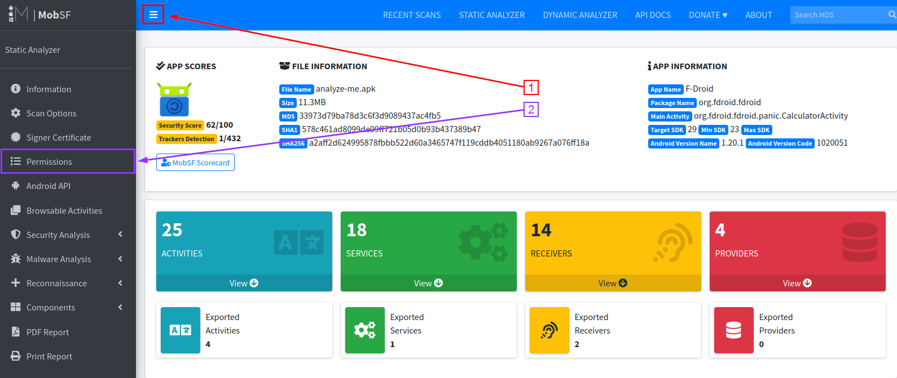
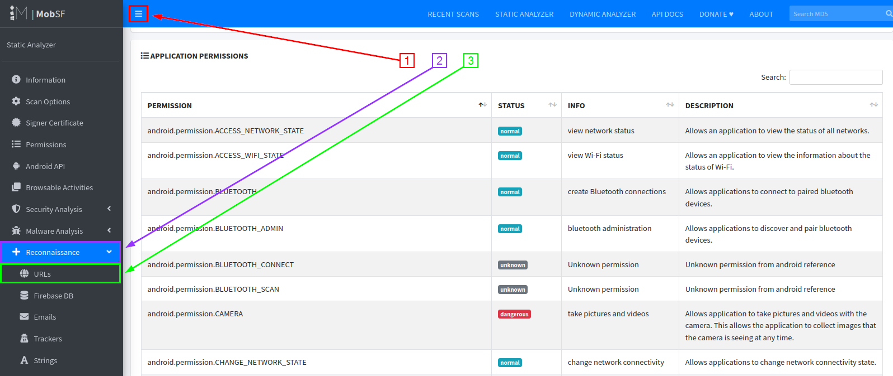
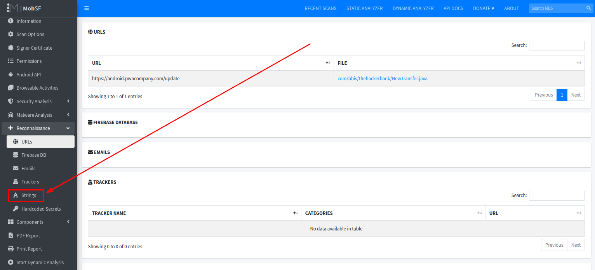
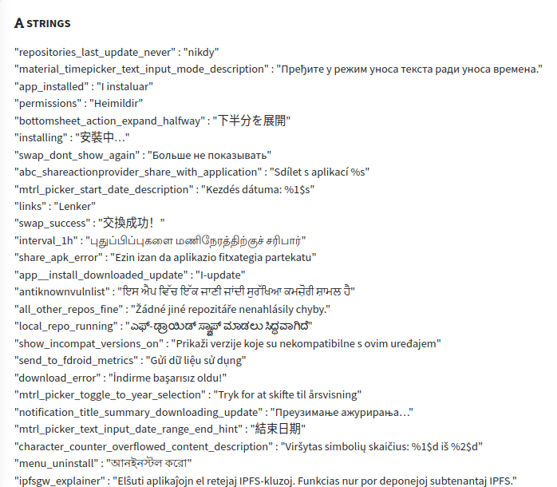
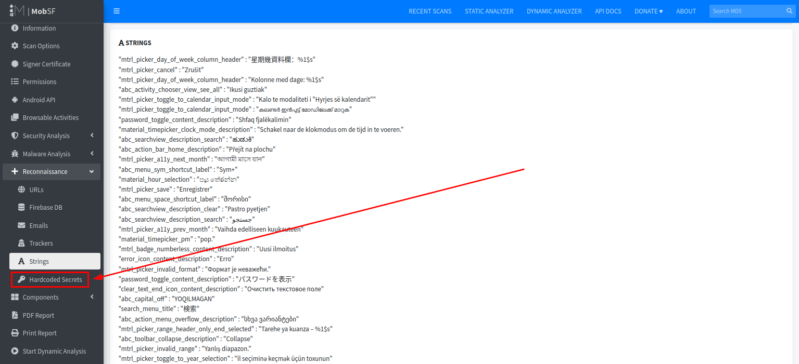
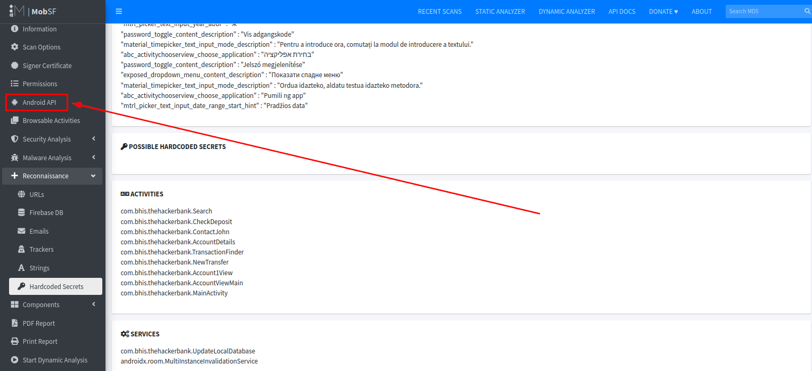
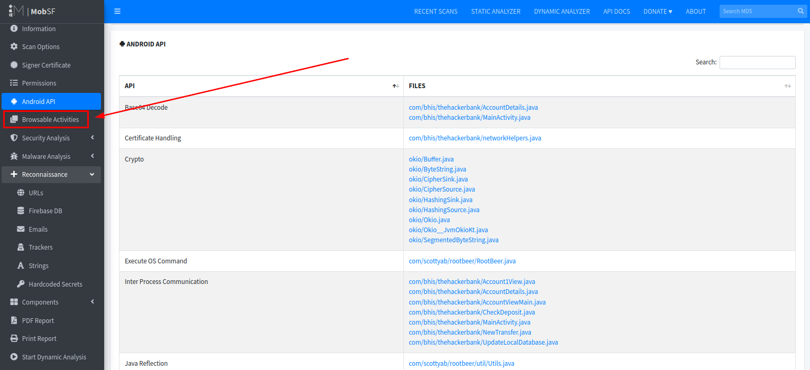

# Static Analysis with MobSF #

>[!WARNING]
>
> I CANNOT STRESS THIS ENOUGH!!!!!!
>
>REMEMBER TO <b style="color:#FF0000;">POWER OFF YOUR CORELLIUM DEVICE</b> WHEN NOT WORKING ON LABS!!!!
>
><b style="color:#FF0000;">CORELLIUM WILL CHARGE YOU!!!!!</b>

In this lab we will be using MobSF to analyze an APK. You can also use the app uploaded for analysis in the "APK_Extraction" lab, or look at one of the pre-generated reports in the course materials section. As an example we will be using the F-Droid app. You are encouraged to repeat this analysis using TheHackerBank app later in the class. Your goal is to analyze ther results and note down anything that stands out for later use.

Let's load up an app and look at it.

>[!Note]
>If you continued on from Lab 2: APK Extraction, you should already have completed the next few instructions. If this is the case, skip ahead to "Once the scan finishes..."

In your VM web browser open a tab to http://0.0.0.0:8000

Next, let's Upload and Analyze a file. 

Please select an apk file in your home directory.

It may take a while for the file to finish Analyzing.

Once the scan finishes, you should see the Static Report of the scan:

The first thing worth paying special attention to is the overview of the app components. Specifically, we want to look at the "exported" activities, services, receivers, and providers.

 The term "exported" means that they can be launched from outside the app itself, which may present additional entry points or other attack vectors. 
 
 We can further analyze the exported components by looking at the manifest file, and if necessary the decompiled code.

 

Here you can download the decompiled java and smali code, which is the disassembled version of the code.

## Permissions

Let's take a look at permissions. Click the three lines in the top left corner to bring up the menu, then select `Permissions`.

Permissions are gathered from the Android manifest file. Each permission is marked with a status, usually either "dangerous" or "normal". 

Whether a permission is actually dangerous depends on both the context and functionality of the application. Permissions are not the most useful thing for a tester, but could be critical for malware analysis.

## Recon
The reconnaissance section is especially useful for gaining a better understanding of the application. 

First let's look at URLs. Click the three lines in the top left corner to bring up the menu, then select `Reconnaissance` to expand the drop-down menu. Now click `URLs`

 We can use this to see where the application is making connections. This could be useful for malware analysis or testing our access outside of the app.

We can also look at strings. Go ahead and click on `Strings` within the same navigation menu as before. 

It is recommended that strings are inserted as key value pairs into the "Strings.xml" file and then referenced by the layout files. Hardcoding the strings into the XML (UI) files creates a lot of noise and requires more time to look through everything.

MobSF extracts potentially sensitive values from this file and displays them in the `Hardcoded Secrets` tab. Let's navigate to it by using the same menu:

You should verify that the information displayed in this section is actually sensitive before reporting it.

<!---->

## API

This section displays the Android APIs that the app uses. This section contains a lot of noise, however it can be useful, especially when combined with the search feature. Let's navigate to it by using the navigation menu:

For example, the following screenshot shows us everywhere the command execution API is used. The files displayed are clickable and will show you the API usage location in code.

## Browsable Activities

Use the navigation menu to click on `Browsable Activities`

MobSF extracts a list of activities that can be triggered by a web browser to display data referenced by a link. These are worth paying attention to, since they can sometimes be leveraged by an attacker to perform web based or internet based attacks.

<!---->

## Certificate Analysis

<!---->

The certificate analysis section will report any known vulnerabilities in the signing schemes of the application. Make sure to validate these before reporting them. When seen fit, report the Android versions affected, and maybe even the overall market share of the those affected versions.

***                                                                 

<b><i>Continuing the course?  [Next Lab](/Labs/LAB_04_Burp_Proxy_Setup/burp-proxy-setup.md)</i></b>

<b><i>Want to go back?  [Previous Lab](/Labs/LAB_02_APK_Extraction/instructions.md)</i></b>

<b><i>Looking for a different lab?  [Lab Directory](/navigation.md)</i></b>