# Setup Burp Suite for Proxy and Interception Testing 

I CANNOT STRESS THIS ENOUGH!!!!!!

REMEMBER TO POWER OFF YOUR VM WHEN NOT WORKING ON LABS!!!!

Corellium WILL CHARGE YOU!!!!!

In this lab we will setup a web proxy using *Burp Suite's Community Edition* and route traffic from our virtual mobile device in Corellium to our MobileApp VM where Burp resides. Following this setup, we will have the capability to intercept web requests made by a given mobile application, as well as inspect and/or manipulate network traffic for the purposes of mobile application testing. 

In order to ensure network traffic is routed from the virtual mobile device to our MobileApp VM, we first need to establish a VPN connection between the two hosts. More details on how to setup a VPN connection can be found [here](https://github.com/deruke/AndroidLabs/blob/main/Labs/Corellium_Setup/gettingstarted.md#VPN).

## Open and Configure Burp
1. With a VPN connection established, return to your MobileApp VM and launch Burp Suite Community Edition by either running to following command or clicking on the Burp icon in the Favorites Toolbar.
 
 Launch Burp via the Favorites Toolbar.

  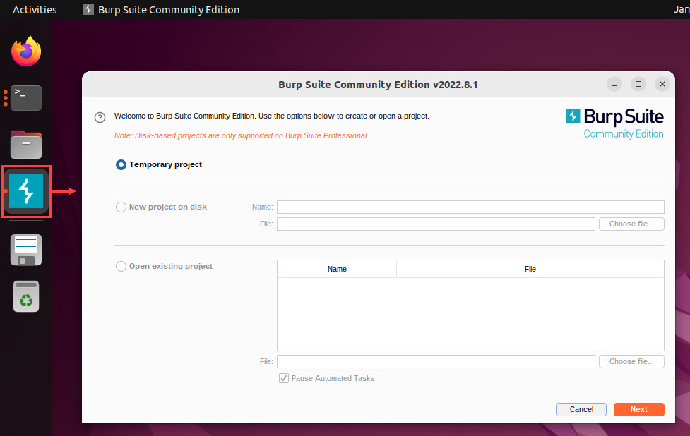

2. Select **Temporary project**, then click **Next**

 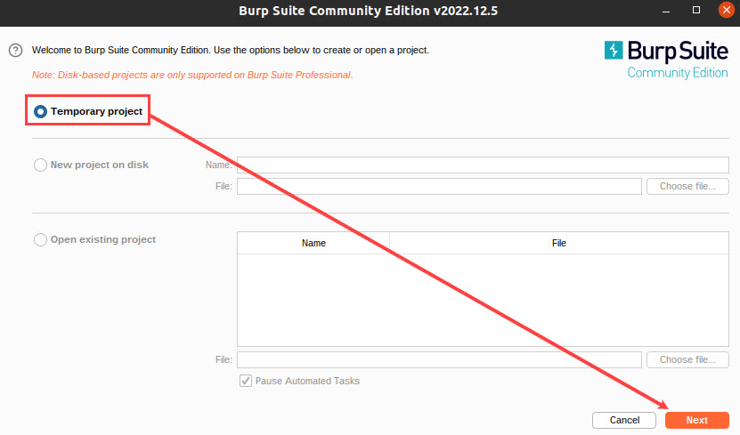

3. Using Burp's menu items, navigate to **Proxy -> Options**

4. Uncheck the "Running" checkbox for interface 127.0.0.1:8080

5. Next click **Add**, then **Bind to address -> Specific address**, and select the IP address assigned to the **tap0** interface. Also, enter the port number in the **Bind to port** field, then click **OK**.   

 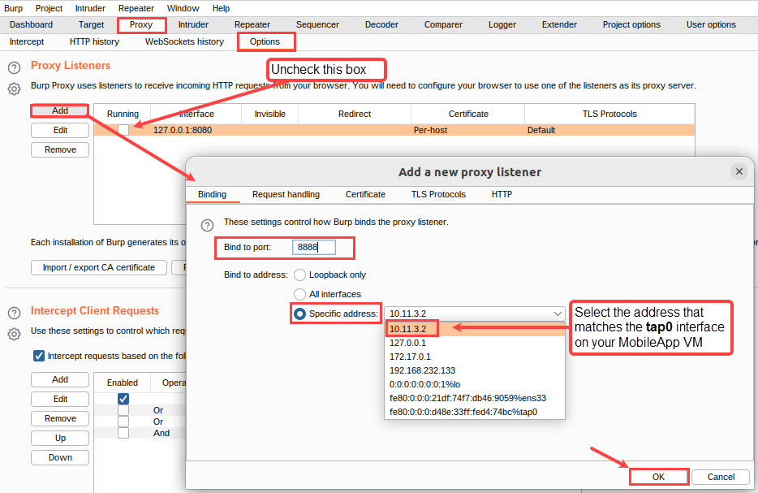

 **NOTE**: The address assigned to your **tap0** interface may be different. To ensure you select the correct IP for Burp to bind to, run the following command from a terminal session on your MobileApp VM.
 
 `ip a show tap0`
 
 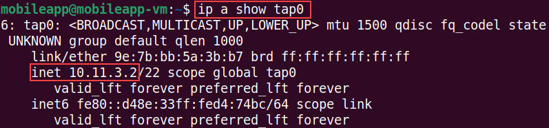

 6. You should now have an active listener in Burp.

 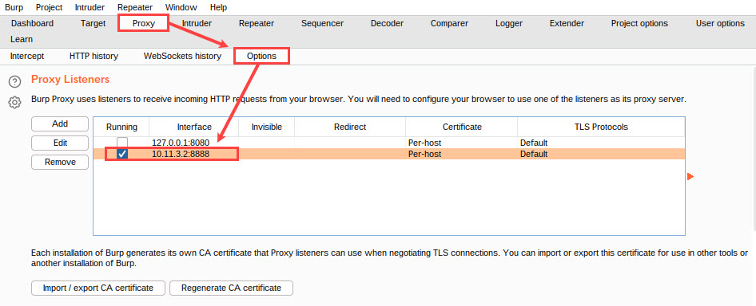

You now have Burp's proxy setup and listening for incoming connections. In the next section of this lab, we will walk through the configuration of the virtual mobile device in Corellium.

## Configuring the Virtual Mobile Device's Proxy Settings

1.  Navigate back to the Corellium web UI and access your virtual mobile device.

2. On the virtual mobile device, navigate to **Settings -> Network & internet**.

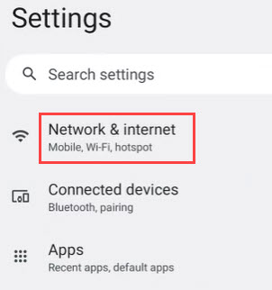

3. Select **Internet**

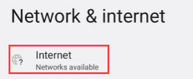

4. Click on the *gear* icon of the *T-Mobile* connection.

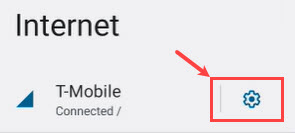

5. Under the settings for the *T-Mobile* interface, scroll down and select **Access Point Names**

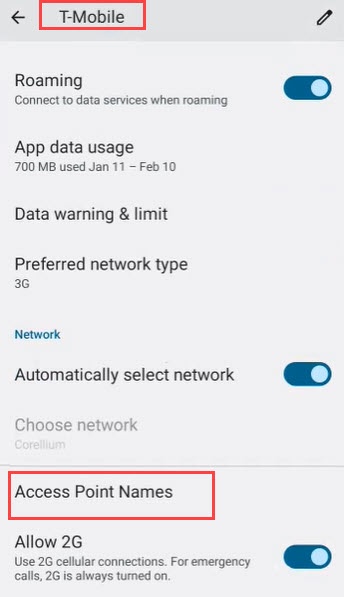

6. Select the **T-Mobile US** APN.

7. Click on the **Proxy** and **Port** fields and enter the value matching Burp's proxy settings. Then select the *Kebab* icon in the top-right corner and click **Save**.

Kebab Icon Location:

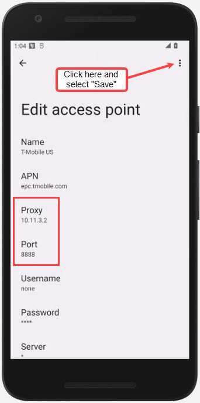

Click Save

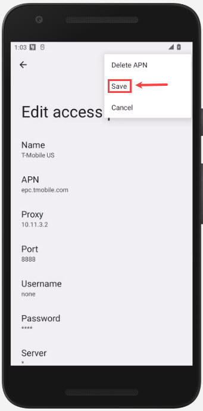

**IMPORTANT:** If you don't save the proxy settings you will need to repeat the previous steps.

9. Navigate back to **Settings -> Network & internet -> Internet** and select the icon at the top-right corner to reset the network interface. This will reset the virtual device's network interface which enables the proxy settings to be recognized by the device.

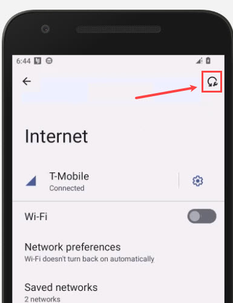

The Internet connection will cycle momentarily during this process.

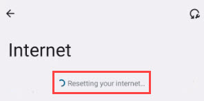

## Configure the Virtual Mobile Device's Certificate Trust for the Burp Proxy Certifcate Authority (CA) - User-Trust

The following steps will walk you through the installation of Burp's CA certificate to the User-Trust Store on your virtual mobile device in Corellium.

**IMPORTANT:** Starting with Nougat (Android 7.0 - API level 24) certificates installed to the User-Trust store are ignored by default; however, with Corellium's implementation of Android devices, some naitive applications have been "patched" to trust the user cert store. If you are using a different mobile device solution for testing, Android devivces 7.0+ (API >= 24) will require the Burp CA cert to be installed to the System-Trust store (see [Lab 5](https://github.com/deruke/AndroidLabs/blob/main/Labs/LAB_X_Import-Burp-Certificate-to-System-Trust-Store/burp-proxy-system-cert-trust.md) for adding Burp's CA to the System-Trust on Android devices).  

1. Return to your instance of Burp running on the MobileApp VM and navigate to: **Proxy -> Options** and click on **Import / export CA certificate**.

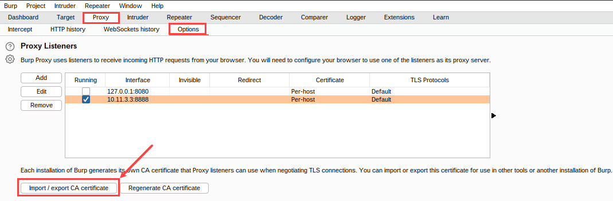

2. Select the **Certificate in DER format** and then click **Next**.

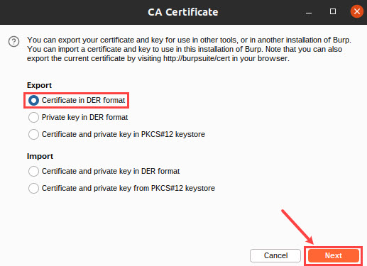

3. Select a location to save the certifcate.

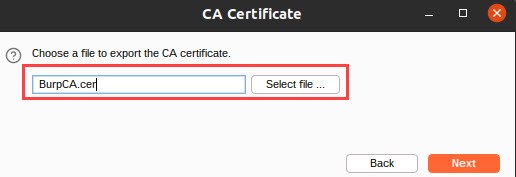

4. Go back to your Corellium instance and click **Files** in the menu, then navigate to **/mnt/sdcard/Download/** and upload the Burp CA file exported in the previous step.

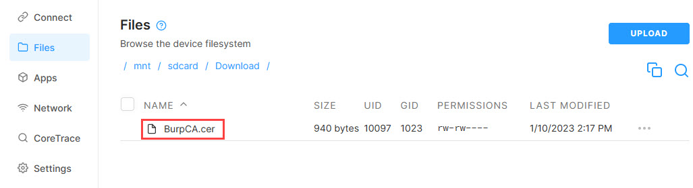

5. Return to the virtual mobile device's home screen (in Corellium) and select the **Settings** icon.

Settings Icon:

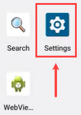

6. Scroll down and select **Security** then find **Encryption & credentials** and select it.

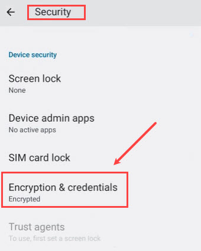

7. Under **Encryption & credentials** click on **Install a certificate**, then click **CA certificate**

Install a certificate:

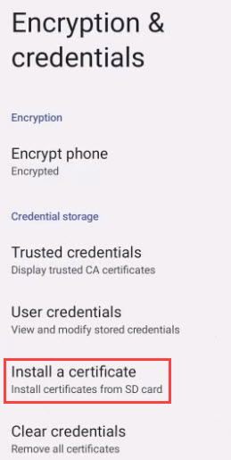

Install a certificate -> CA Certificate:

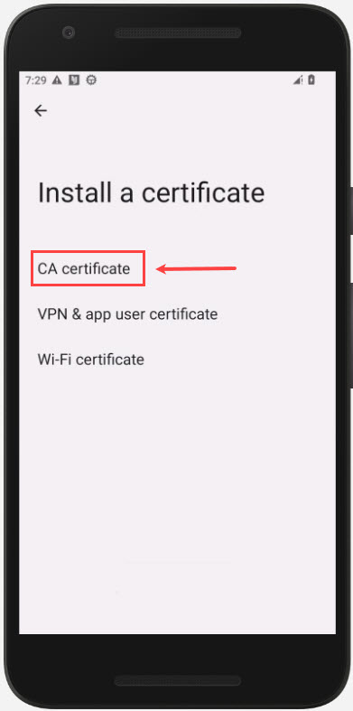

8. A prompt will warn you of the dangers involved with installing a CA certificate...click **INSTALL ANYWAY** to proceed.

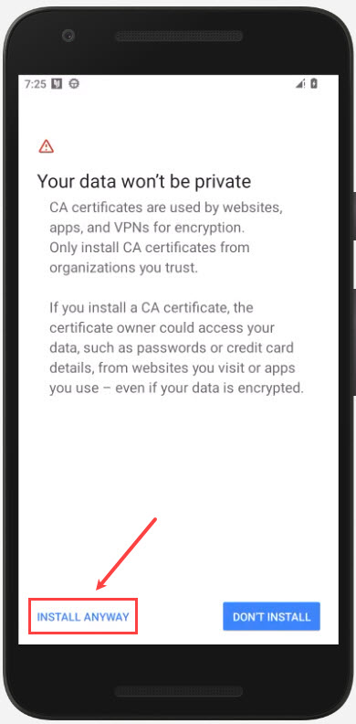

9. Next, click the *Hamburger* icon and select **Downloads**, then click on the Burp certificate you uploaded in step 4.

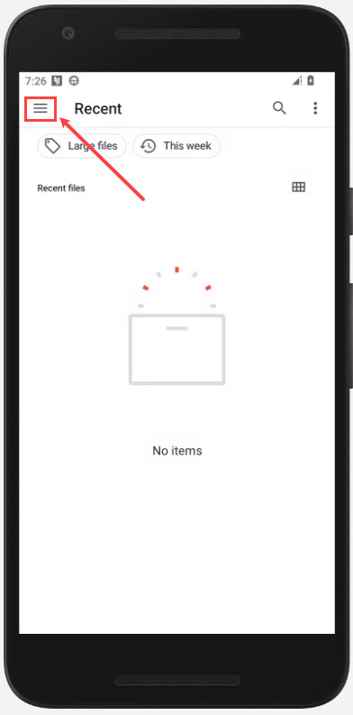

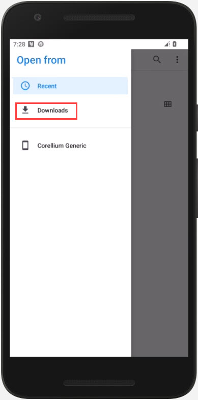

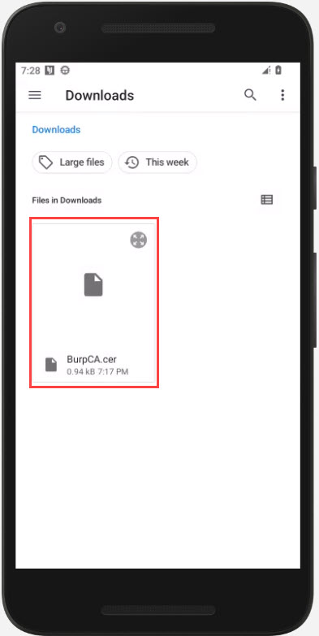

10. If successful, a temporary pop-up wil appear indicating *"CA certificate installed"*.

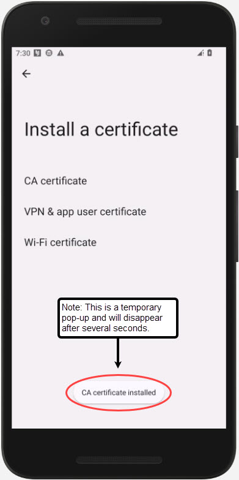

11. To verify that the certifcate was installed to the User-Trust store, navigate to **Settings -> Security -> Encryption & credentials -> Trusted credentials -> User**

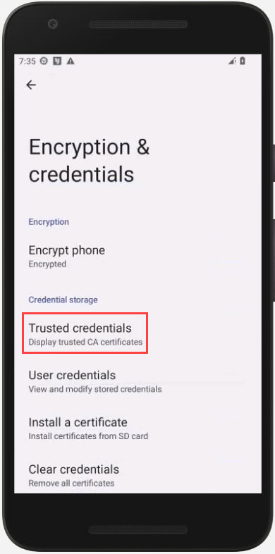

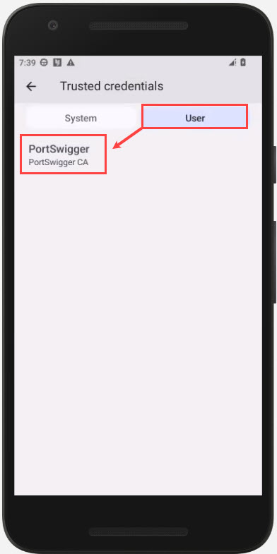

12. Launch the Web View app from the virtual device in Corellium and enter a common Internet resource, such as *https://www.google.com*.

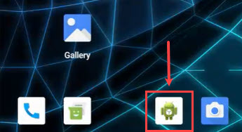

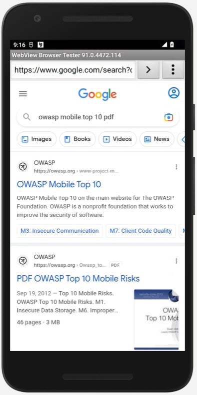

13. Finally, navigate back to your MobileApp VM and from within Burp, navigate to **Proxy -> HTTP history**. 

You should see your web traffic processed by Burp's proxy.

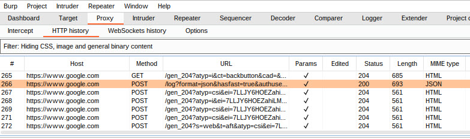

### Not seeing traffic in Burp?

Follow the below items to ensure all required steps have been taken:

1. Ensure the VPN connection between Corellium and the MobileApp VM is established.

2. Ensure the Burp proxy options (IP Address and Port) are properly set and the proxy is listening.

3. Check the User-Trust store to ensure the CA certificate is installed.

4. Check the proxy settings on the virtual mobile device to ensure they match that of the **tap0** interface as well as Burp's proxy settings.

5. If everythihg checks out and still no luck:
    - Reboot the virtual device
    - Cycle the VPN connection (off/on again)
    - If the **tap0** interface receives a different IP than what was previously set in Burp: update the settings in Burp as well as the proxy settings on the device.
    - Be sure to save the proxy settings on the virtual device 

