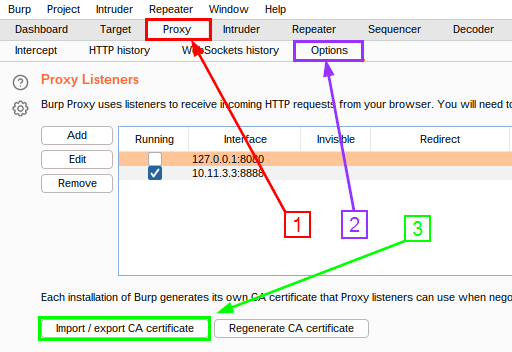
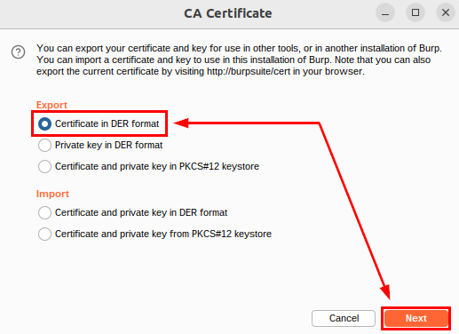
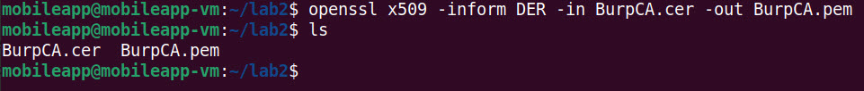
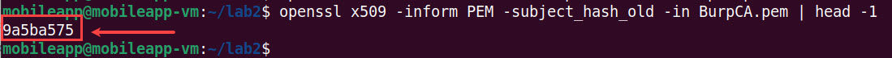
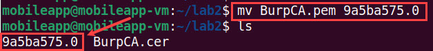
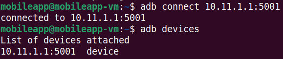
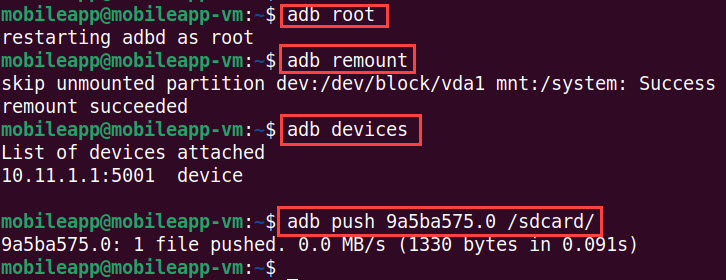
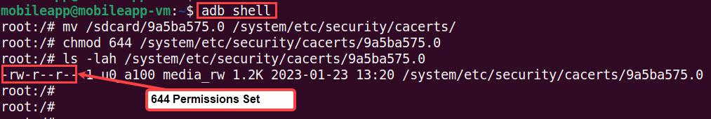
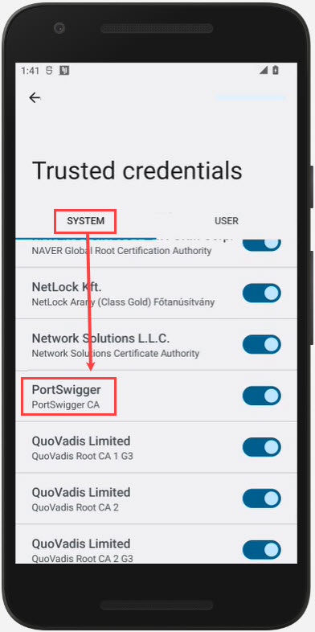

 # Importing Burp's CA Certificate to the System-Trust Store (Android) 

I CANNOT STRESS THIS ENOUGH!!!!!!

REMEMBER TO POWER OFF YOUR CORELLIUM DEVICE WHEN NOT WORKING ON LABS!!!!

Corellium WILL CHARGE YOU!!!!!

***
 
In this lab we will import and install Burp's CA certificate to the System-Trust store of our virtual mobile device.

**NOTE**: The mobile device must be rooted in order to install a CA certificate to the System-Trust store. We'll be utilzing a rooted Android device in Corellium for this lab.

**IMPORTANT**: Starting with Nougat (Android 7.0 - API level 24) certificates installed to the User-Trust store are ignored by default. However, with Corellium's implementation of Android devices, some native applications have been "patched" to trust the user cert store. See [here](https://github.com/deruke/AndroidLabs/blob/main/Labs/LAB_X_Burp-Proxy-Setup/burp-proxy-setup.md#configure-the-virtual-mobile-devices-certificate-trust-for-the-burp-proxy-certifcate-authority-ca---user-trust) for instructions on how to add a CA certificate to the User-Trust store. 
If you are using a different mobile device solution for testing, Android devices 7.0+ (API >= 24) will require the Burp CA cert to be installed to the System-Trust store. Additionally, 3rd-party apps installed on a Corellium virtual mobile device may also require the Burp CA to be installed to the System-Trust store.

**NOTE**: In order to ensure network traffic is routed from the virtual mobile device to our MobileApp VM, a VPN connection between the two hosts is required. If you don't have a VPN connection established, refer to the [lab](https://github.com/deruke/AndroidLabs/blob/main/Labs/Corellium_Setup/gettingstarted.md#VPN) on how to setup a VPN connection before proceeding.

## Export Burp's CA Certficate and Prep for Install
1. Return to Burp and navigate to **Proxy -> Options** and click **Import/export CA certificate**.

2. Select **Certificate in DER format**, then click **Next**

3. Save the file locally on the MobileApp VM.

**NOTE**: The Android device requires the certificate to be in PEM format, and to have the filename equal to the `subject_hash_old` value appended with `.0` extension.

4. From a terminal session, type the following `openssl` command to convert the certificate from DER to PEM.

<pre>openssl x509 -inform DER -in BurpCA.cer -out BurpCA.pem</pre>

5. Use the `openssl` command once again to identify the `subject_hash_old` value.

<pre>openssl x509 -inform PEM -subject_hash_old -in BurpCA.pem | head -1</pre>

6. Rename the pem-formated certificate to `<hash>.0`

<pre>mv BurpCA.pem 9a5ba575.0</pre>

## Importing the CA to the mobile device's System-Trust Store - via adb

1. Connect to your virtual mobile device via `abd`.

An important thing to note, if you run this command and see more than one device (such as localhost:5001), you will need to run `adb disconnect [device name]` so you can continue on to the next steps.

**NOTE**: Reference [LAB 1](https://github.com/deruke/AndroidLabs/blob/main/Labs/LAB_1_adb_basics/adb_cheatsheet.md) for instructions on how to connect and how to use the Android Debug Bridge (adb). 

**NOTE**: The screen capture below is an example of the adb tool used to connect to the virtual mobile device with a VPN established between Corellium and the MobileApp VM. To establish a connection over SSH instead, please see the establishing an [SSH Connection](https://github.com/deruke/AndroidLabs/blob/main/Labs/LAB_0_Corellium_Setup/gettingstarted.md#SSH) section in the [Getting Started Lab](https://github.com/deruke/AndroidLabs/blob/main/Labs/LAB_0_Corellium_Setup/gettingstarted.md).

2. Copy the certificate to the device. We can use `adb` to copy the certificate over, but since it has to be copied to the `/system` filesystem, we have to remount it as writable. To start, we need to become root. Let's run the following command:

<pre>adb root</pre>

As root, we will remount and push the certificate to the local file system of the virtual mobile device. To do so, let's run the following commands:

<pre>adb remount</pre>

<pre>adb push [cert].0 /sdcard/</pre>

3. We need to drop into a shell and move the file to `/system/etc/security/cacerts` and run the `chmod` command with permissions set to **644**:

Start by running the following:
<pre>adb shell</pre>

Now move the file to the correct location:

<pre>mv /sdcard/[cert].0 /system/etc/security/cacerts/</pre>

And finally, change the permissions:

<pre>chmod 644 /system/etc/security/cacerts/9a5ba575.0</pre>

4. Run the `ls` command to verify the correct permissions are set.

<pre>ls -lah /system/etc/security/cacerts/[cert].0</pre>

5. Within the adb shell, run the `reboot` command and hit enter to reboot your virtual device. (May take a minute for the UI to come back up)

## Verify that Certificate was Added Successfully

Return to your virtual device in Corellium and navigate to **Settings -> Security -> Encryption & Credentials -> Trusted Credentials -> System**. Then scroll down until you see *PortSwigger - PortSwiggerCA*.

