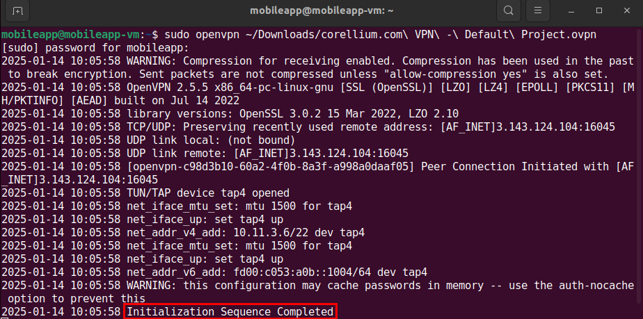
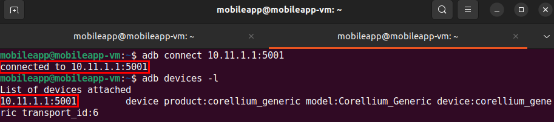
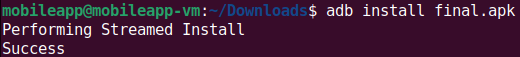
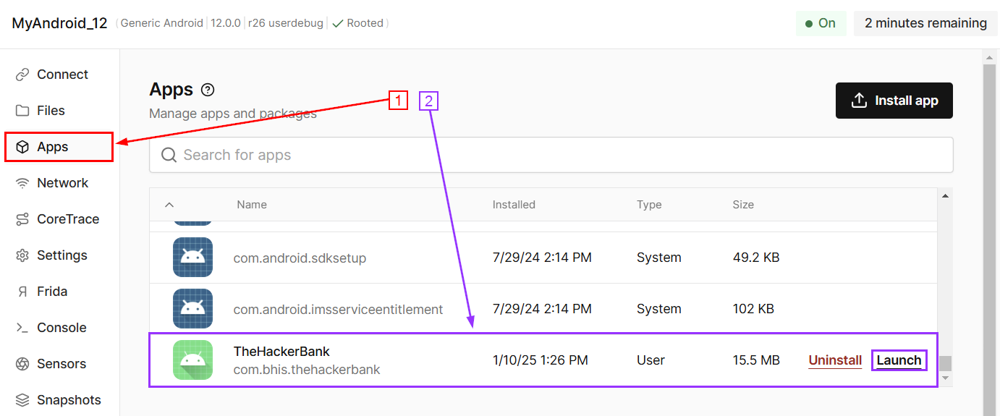
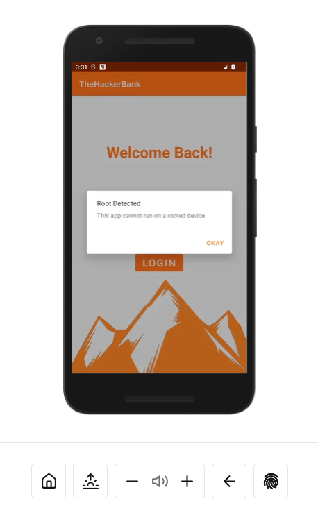
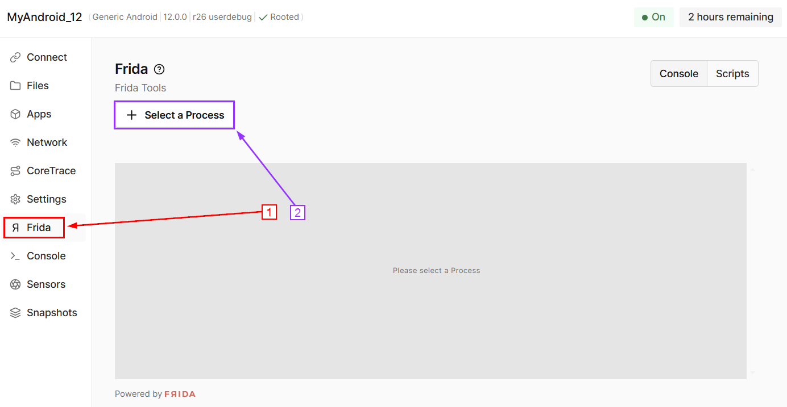
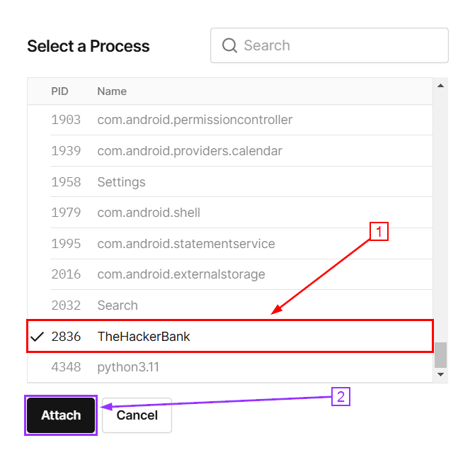
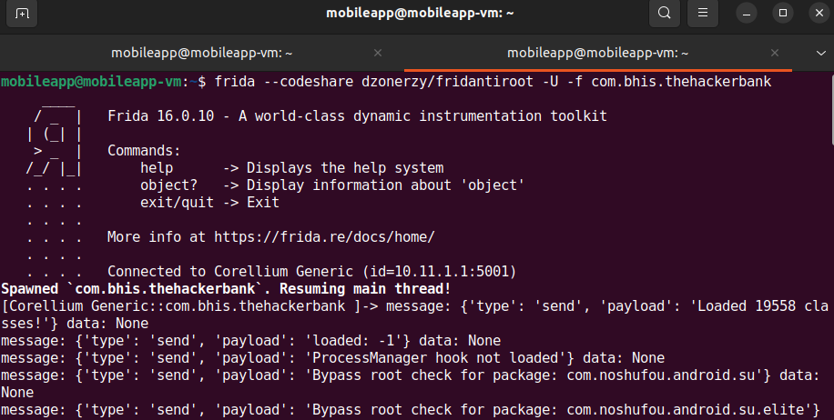
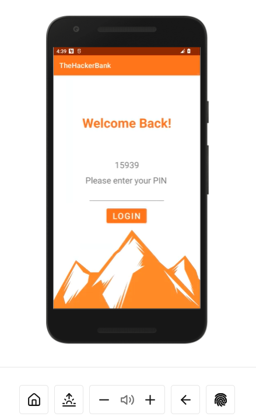

## Bypassing Root Detection using Frida

I CANNOT STRESS THIS ENOUGH!!!!!!

REMEMBER TO <b style="color:red;">POWER OFF YOUR CORELLIUM DEVICE</b> WHEN NOT WORKING ON LABS!!!!

<b style="color:red;">CORELLIUM WILL CHARGE YOU!!!!!</b>

***

There are two potential methods of bypassing root detection: statically, by removing the relevant code and recompiling the apk, or dynamically.

In this lab, we will bypass the root detection at runtime using Frida. The target application is `The Hacker Bank`.

Let's install that app now.

First, please download the following file.

```https://github.com/strandjs/IntroLabs/blob/master/IntroClassFiles/Tools/final.apk```

Next, we need to ensure the VPN is up and running. 

**Note:** the following command can likely be used to do so:

<pre>sudo openvpn ~/Downloads/corellium.com\ VPN\ -\ Default\ Project.ovpn</pre>



Now let's install the application on our phone.

Start by connecting via adb.

<pre>adb connect 10.11.1.1:5001</pre>

**Note:** to check that you successfully connected the device, use the following command:

<pre>adb devices -l</pre>



Next, let's install the app on our phone by pushing it through adb.

**Note:** before running the following command, ensure that you are in the directory where `final.apk` was downloaded to. In this instance, our file is located within the `Downloads` directory.

<pre>adb install final.apk</pre>



Now we need to launch TheHackerBank app. To do this, navigate back to the `Apps` page of your Corellium device and find `TheHackerBank`:

**Note:** you can use the search bar to find it quicker!



After opening the app on your phone we see that we do not have the option to do anything other than acknowledge the alert, which consequently closes the application.



For the next part of the lab, we are going to use Frida to bypass the root detection. Now, usually we would need to install Frida, but luckily for us, our Corellium device already has it installed!

**The following Commands are for reference only and do not need to be run on the Corellium device since it has the frida server pre-installed.**

<!--Typically, we would need to upload and start the Frida server on the device we are testing. That can be accomplished by restarting adb as root, and running the following commands:

* `adb push ~/Downloads/frida-server-15.2.2-android-x86 /data/local/tmp/frida-server`

* `adb shell "chmod 755 /data/local/tmp/frida-server"`

* `adb shell "/data/local/tmp/frida-server &"`
**End of reference commands.**-->

We will be using [This script](https://codeshare.frida.re/@dzonerzy/fridantiroot/) from Frida Codeshare to bypass root detection on our target.

But first we need to attach an existing process to Frida on the phone.  

On the left side of your device screen in Corellium select `Frida` then click `Select a Process`.



Wait till it loads the processes then select `TheHackerBank` and then `Attach`:



Once the process is attached, open up a terminal in the VM.

<!--You can either download the script, and run it with the `-l` option, or, run it directly from the website with `--codeshare dzonerzy/fridantiroot-->

Now run the following command:

 <pre>frida --codeshare dzonerzy/fridantiroot -U -f com.bhis.thehackerbank</pre>

 the `-U` option tells frida to connect to the usb device (in our case the emulator "appears" as a usb device).

 The `-f` option specifies the target application ID that we want to load. The application should **not** be running already. the `-f` flag will spawn the process.



**Note:** if prompted, enter `y` when  if you would like to trust the project.

After doing this, we can go back to our Corellium device. You should now see that the app has been launched, but this time root detection was not triggered!


