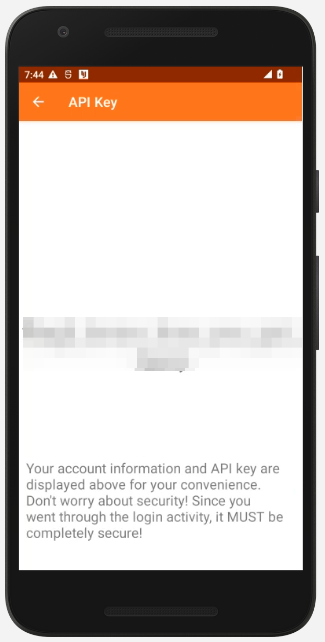
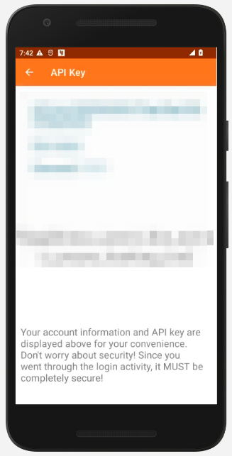

# Intent Manipulation 1 #

I CANNOT STRESS THIS ENOUGH!!!!!!

REMEMBER TO POWER OFF YOUR VM WHEN NOT WORKING ON LABS!!!!

Corellium WILL CHARGE YOU!!!!!

In this lab we will be using "Intents" to bypass access controls.

## What is an intent? ##
An "intent" is a "message object" typically used communicate between different activities in your application.

Sometimes however, intents can be sent between applications. A legitimate example of this might be your camera accepting an intent from your banking app in order to take a photo of a check.

By analyzing the <a href="https://www.blackhillsinfosec.com/field-guide-to-the-android-manifest-file/">manifest file</a> of our app, we noticed the following activity is exported.
```xml
<activity
    android:name=".AccountDetails"
    android:parentActivityName=".AccountViewMain"
    android:exported="true">
        <meta-data
            android:name="android.app.lib_name"
            android:value="" />
</activity>
```
This means the activity can be launched by a process outside of the application. For our example, we will use our best friend `adb`.

## Invoking Intents from ADB ##
using the adb shell we can execute a specific activity within the app.

The below command executes the activity specifies after the -n option.

`adb shell am start -n com.bhis.thehackerbank/.{ACTIVITY NAME}`

The name of each activity present in the application can be found in the manifest file 



`adb shell am start -n com.bhis.thehackerbank/.AccountDetails`

We can also pass data when starting intents with ADB. For example, running the below command results in a different result than running the command above.

`adb shell am start -n com.bhis.thehackerbank/.AccountDetails --es "USER_COOKIE" "nothinginparticular"`

When executed correctly, the app will behave slightly differently.<br>


The command above requires us to know the name of the intent extra. These can be found by looking at the source code in a program such as jadx.

Another thing to check at this point is where you can go from here. With this application, pressing the back arrow will result in the application crashing, however this is not always the case.
