# Bypassing Certificate Pinning with Frida #
### What is certificate pinning?
One of the many things that happens during the TLS handshake is the server sends the client its certificate which includes the servers public key. The client then checks the validity of that certificate.

For a certificate to be "pinned" to the application, it means that the servers certificate or part of it, such as the public key is hardcoded into the application. The client can then check not only that the certificate is valid, but also that it is the certificate the client was expecting. 

The purpose of this is to prevent traffic interception such as the burp proxy that we previously set up.

## Instructions ##
Log into the app, and then click on the "Contact John" button near the bottom of the page.

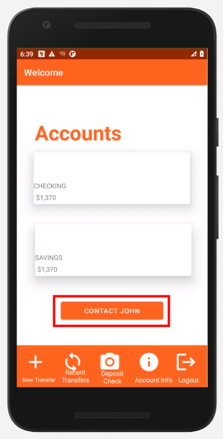

On the nect screen pressing the "Send beacon to John" button will yield an error as shown below.
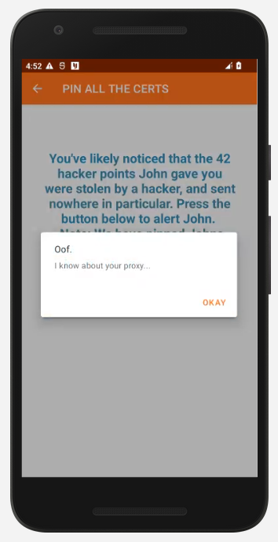

To bypass the certificate pinning we are going to use a frida script. [this script](https://github.com/httptoolkit/frida-android-unpinning) will work, however you may find others that work as well.

Instead of starting the process through the command line, this time we are going to connect to an already running process through Corellium. 

The first thing we will do is connect to the running process.
On the left slect "Frida" and then click "Select a Process".
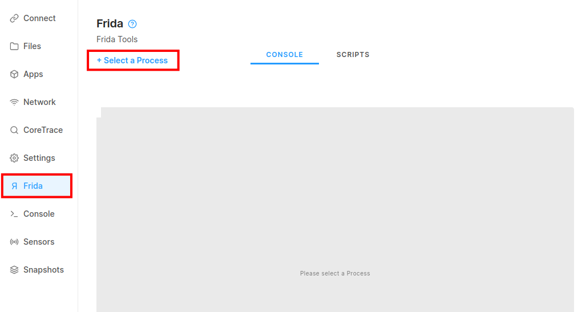
Check the box on the left for the process `TheHackerBank` and then press "attach".
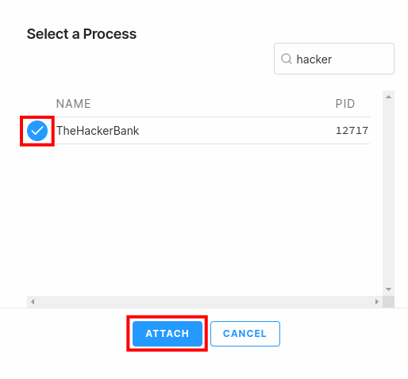,

Now in the console window you should see the frida instance:
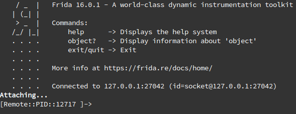

Next we need to upload the Frida script to Corellium. Switch over to the scripts tab and click "upload"
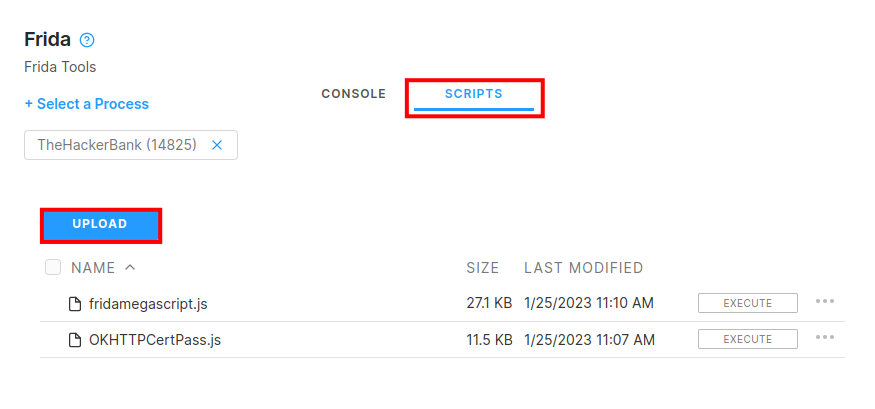

Then select your file and click the execute button.
(It will appear that nothing happened, but it worked)
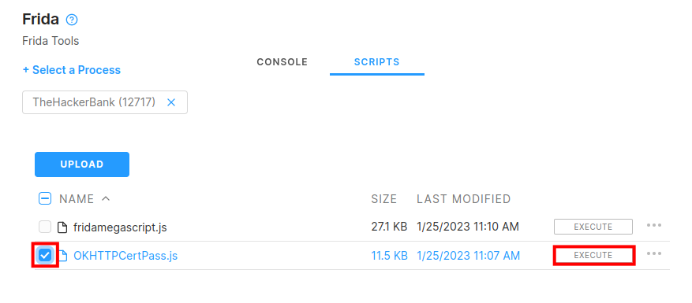

Now switch back to the console tab.
You will be prompted to confirm you want to load the scipt. Type "y" and press enter.
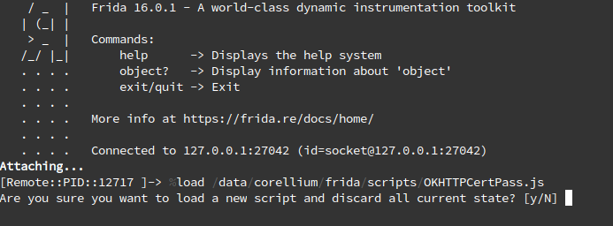

The script determines how certificate pinning is being implemented and attempts to bypass those mechanisms. We can see it detects our app is using the okhttp library.
At this pint the script might throw an error about a counter, but don't worry, its still running.

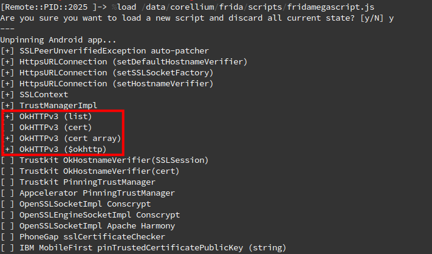

Now if we click the "Send Beacon To John" Button again, we should get a different result.

If done correctly, you should see something similar to the screenshot below.
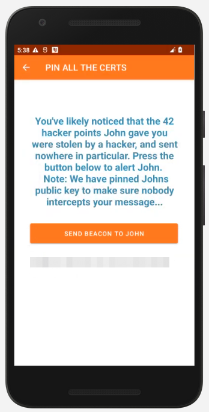

If you want to add some data to the request, you can do so through the burp proxy.

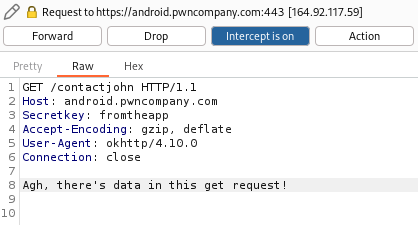

You need a newline before the data, otherwise it will be interpreted as a header. Also don't forget the two newlines at the end!

