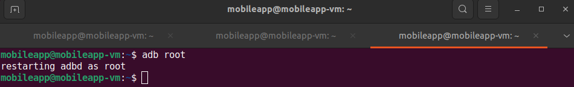
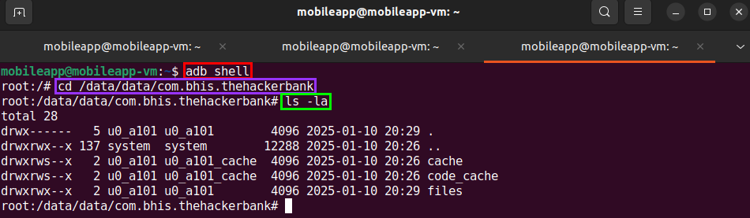
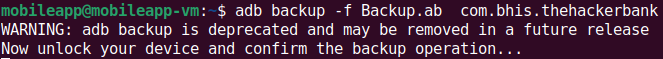
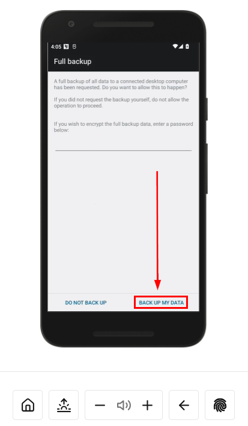

# Exploring The Filesystem #

>[!WARNING]
>
> I CANNOT STRESS THIS ENOUGH!!!!!!
>
>REMEMBER TO <b style="color:#FF0000;">POWER OFF YOUR CORELLIUM DEVICE</b> WHEN NOT WORKING ON LABS!!!!
>
><b style="color:#FF0000;">CORELLIUM WILL CHARGE YOU!!!!!</b>

In this lab, we are going to investigate the file system of `TheHackerBank` application.

>[!Note]
>Before continuing, make sure that your VPN connection is established and that your device is connected.

>[!Note]
>This is most effective after you have browsed through the functionality of the app, since it is likely that things get written to the filesystem during runtime.

To get started, we need to get into a root shell on our device. 

In a terminal on the MobileApp VM, run `adb root`.

This command will restart the device as a root:

Next, start a shell by using `adb shell`. 

Now we can `cd` into the application's internal storage by running the following:

<pre>cd /data/data/com.bhis.thehackerbank</pre>

Once we are in this directory, we can run `ls -la` to see a long listing of all contained files:

We will take the files off of the device for offline analysis.

There are several ways this can be done:

## Method #1: Creating a Backup
One option is to make a backup of the app. We will be able to do this only if allowbackup="true" in the manifest file.

<pre>adb backup -f Backup.ab  com.bhis.thehackerbank</pre>

Navigate back to your Corellium device. You will need to click `BACK UP MY DATA` on the phones gui:

## Method #2: Using `adb pull`

Another method is to download all of the application's data with the `adb pull` command:

<pre>adb pull /data/data/com.bhis.thehackerbank</pre>

>[!Note]
>These two methods produce the same result, however, adb pull will only work if the device is rooted, and adb backup will only work if the app allows backups, but will work regardless if the device is rooted.

## Analysis

If there is a large amount of data contained in the output file, it may be beneficial to move the data to a tar archive on the system before pulling it down.

<pre>tar cvzf filesystem.tar.gz /data/data/[package-name]</pre>

Then on the host you are using for analysis run `tar -xvzf filesystem.tar.gz`

After that you're on your own for analysis.

For example: `grep -InrE pass|key|token|api|cred|auth|cookie` might be a good place to start.

Additionally, the application may use external storage. You might have noticed `TheHackerBank` does not have the WRITE_EXTERNAL_STORAGE permission declared in the manifest file. The app does however write to external storage. Since android 10, android uses a "Scoped Storage" model. Can you figure out where those "Check Deposit" images go?

## Extra Credit ##
You have root on the device and can browse data data for any of the applications. Look through the file system for another app of your choice.
