# Static Analysis with MobSF.live #

In this lab we will use [MobSF.live](https://mobsf.live), the public hosted instance of the Mobile Security Framework (MobSF) static analyzer published by the MobSF project. It is the same engine you would run locally, but there is nothing to install: you upload an APK from your browser and get the full static report.

The core of this lab needs only a web browser. Two optional parts (Step 1 Option B and the challenge bonus) use the Pixel 9 Android Studio emulator from the setup lab.

Your goal is to analyze the results and note down anything that stands out for later labs (Burp, Frida, dynamic testing). Fill in the findings table at the end of the lab as you go.

>[!NOTE]
>MobSF.live is a shared server. If an upload hangs or the site is busy, wait a few minutes and try again. MobSF.live only does **static** analysis; ignore the `Start Dynamic Analysis` option.

## Step 1: Get the Target APK ##

We will use the **OWASP MASTG Hacking Playground** app as the worked example. It is intentionally vulnerable and open-source, so it is safe to upload.

### Option A: Download it (required) ###

Download it by clicking this link in your browser:

https://github.com/OWASP/MASTG-Hacking-Playground/releases/download/1.1/MSTG-Android-Java.apk

Or from a terminal:

`wget https://github.com/OWASP/MASTG-Hacking-Playground/releases/download/1.1/MSTG-Android-Java.apk`

Now get the file's SHA256 hash and write it down. You will compare it with the hash MobSF reports in Step 2.

| OS | Command |
| --- | --- |
| Linux | `sha256sum MSTG-Android-Java.apk` |
| macOS | `shasum -a 256 MSTG-Android-Java.apk` |
| Windows (PowerShell) | `Get-FileHash MSTG-Android-Java.apk` |

### Option B: Pull it from your emulator (optional) ###

On a real test you pull the APK from a device. To practice that safely, install the MASTG app on your emulator and pull it back off, exactly as you would with a target app.

Start the emulator as in the setup lab: run `android-studio`, click `More Actions` -> `Virtual Device Manager`, and click the `Play` icon next to `Pixel 9`.

Or skip Android Studio and start it straight from a terminal:

`cd ~/Android/Sdk/emulator/
./emulator -list-avds
./emulator -avd Pixel_9`

`-list-avds` prints the names of your virtual devices; `Pixel_9` is the one we use. The emulator keeps running in that terminal, so leave it open.

When it has booted, open a **new** terminal and check that adb sees it:

`adb devices`

You should see a line like `emulator-5554   device`.

>[!NOTE]
>If you get `adb: command not found`, use the full path: `~/Android/Sdk/platform-tools/adb`.

Install the app, find its package name and APK path, and pull it:

`adb install MSTG-Android-Java.apk
adb shell pm list packages | grep -i owasp
adb shell pm path sg.vp.owasp_mobile.omtg_android`

`pm path` prints one or more lines like `package:/data/app/.../base.apk`. Pull the file (drop the `package:` prefix) and hash it:

`adb pull /data/app/[...]/base.apk ~/pulled.apk
sha256sum ~/pulled.apk`

Compare the hash with the one from Option A. If they match, you pulled exactly the file you installed.

>[!NOTE]
>If `pm path` returns several files (`base.apk` plus `split_config.*.apk`), the app was installed as split APKs. The code and the `AndroidManifest.xml` live in `base.apk`, so that is the one to analyze. The splits usually only hold language, screen density, or CPU architecture resources.

## Step 2: Upload and Scan ##

In your web browser, open https://mobsf.live

Click `Upload & Analyze` and select your APK. Your browser asks you to confirm that the upload will be publicly available; click `OK`.

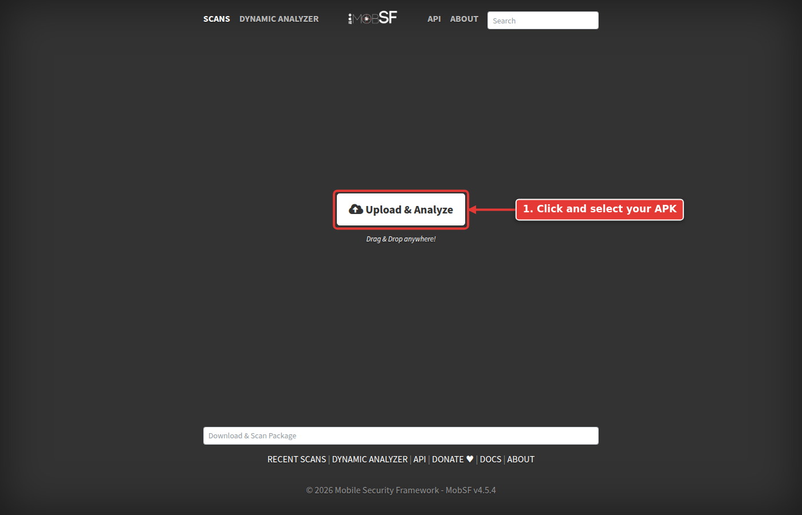

You land on the `Scan Queue` page. The scan usually takes one to a few minutes depending on the app size and how busy the server is. When your file's status changes to `Success`, click `View Report` in its row to open the static report. If someone already scanned the exact same file, MobSF.live skips the queue and opens the existing report straight away.

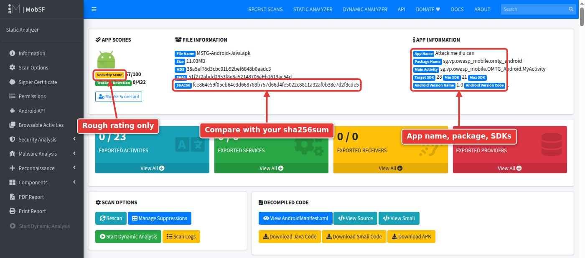

The `FILE INFORMATION` and `APP INFORMATION` cards at the top (`Information` in the menu) show the file name, size, hashes, app name, package name, and SDK versions. **Check that the SHA256 matches the one you wrote down.** This proves you are looking at the report for the exact file you think you uploaded, which matters when you later cite this report in a finding.

For the MASTG app you should see:

| Field | Value |
| --- | --- |
| App name | Attack me if u can |
| Package | sg.vp.owasp_mobile.omtg_android |
| Min / Target SDK | 21 / 28 |

The `Security Score` is MobSF's own rough rating. Do not put it in a report as a finding; use it only as a quick first impression.

## Step 3: Exported Components ##

The overview shows four cards: **EXPORTED ACTIVITIES**, **EXPORTED SERVICES**, **EXPORTED RECEIVERS**, and **EXPORTED PROVIDERS**.

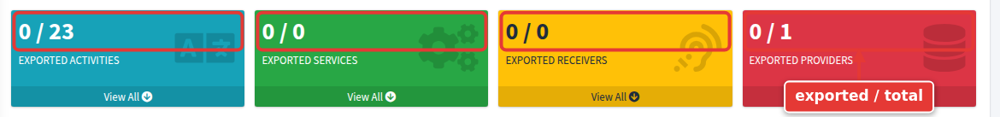

"Exported" means the component can be started by other apps on the device, not only by the app itself. Every exported component is an entry point worth testing. In the dynamic labs you will reach them with `adb shell am start` (activities), `am startservice` (services), `am broadcast` (receivers), or `content query` (providers). For now, just list them.

A few rules that explain what you see here:

 * A component with an `<intent-filter>` was exported by default on older target SDKs. Apps targeting Android 12 (API 31) or higher must set `android:exported` explicitly.
 * Content providers were exported by default when the app's minSdk or targetSdk is 16 or lower.

Each card shows `exported / total`. The MASTG app shows `0 / 23`, `0 / 0`, `0 / 0`, and `0 / 1`: **0** exported in all four. That is a correct result, not a broken scan: its content provider exists (the `1`) but is not exported. You can confirm this under `Components -> Providers` in the menu.

The menu is the sidebar on the left of the report. On a narrow window it is hidden; click the three lines at the top left to open it.

To see how each component is declared, use the menu to go to `Security Analysis -> Manifest Analysis`, or use the `DECOMPILED CODE` card on the overview (`View AndroidManifest.xml`, `Download Java Code`, `Download Smali Code`).

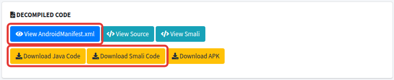

## Step 4: Manifest Analysis ##

Open the menu and select `Security Analysis -> Manifest Analysis`.

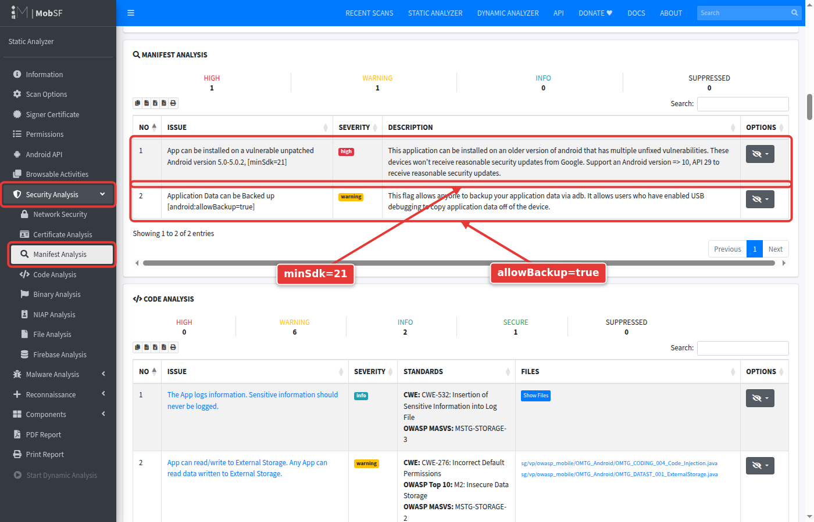

For the MASTG app you should see two findings:

 * **App can be installed on a vulnerable unpatched Android version** (minSdk=21). The app still installs on Android 5.0, which no longer receives security patches.
 * **Application Data can be Backed up** (`android:allowBackup=true`). App data can be extracted with a backup, which is worth testing later if the app stores anything sensitive locally.

These are configuration findings. Their real severity depends on what the app stores and who it targets, so note them and confirm impact before reporting.

## Step 5: Permissions ##

Open the menu and select `Permissions`.

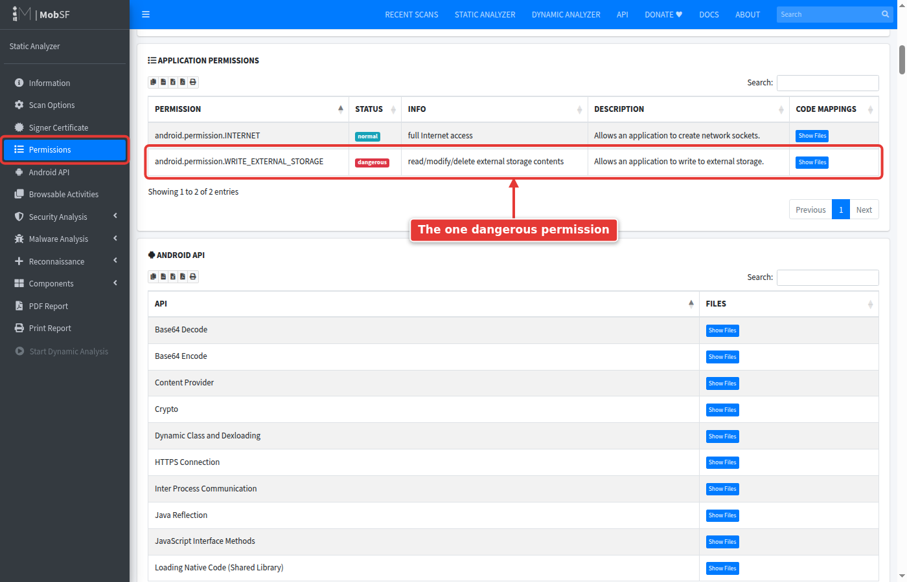

Permissions are read from the manifest. MobSF labels each one, mostly as `dangerous` or `normal`, based on Android's protection levels. "Dangerous" is Android's term for permissions that touch private user data; it does not mean the app is doing something dangerous.

The MASTG app requests one dangerous permission: `WRITE_EXTERNAL_STORAGE`. Keep that in mind for Step 7, because the code analysis flags external storage use.

Permissions are not the most useful section for an app tester, but they are important for malware analysis. The related `Malware Analysis -> Abused Permissions` section lists permissions commonly abused by malware.

## Step 6: Android API ##

Open the menu and select `Android API`.

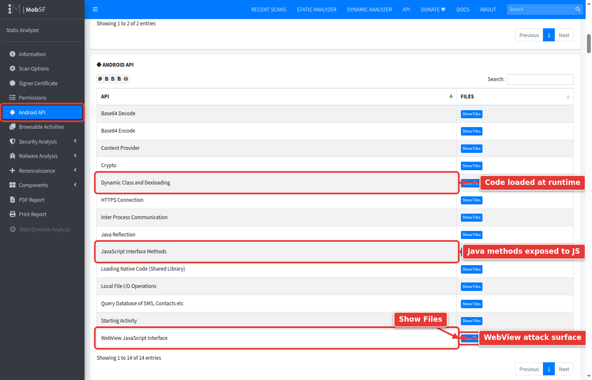

This lists which Android APIs the app uses and in which files. It is noisy on its own but useful to direct your manual review. Click `Show Files` next to an API to list the files that use it; every file name is clickable and opens the code at that location.

The table shows 10 rows per page, so use `Next` (or the `Search` box) to reach the rest. In the MASTG app, look at:

 * **WebView JavaScript Interface** and **JavaScript Interface Methods**: a WebView that exposes Java methods to JavaScript is a classic attack surface.
 * **Dynamic Class and Dexloading**: the app loads code at runtime, which static analysis cannot fully see.
 * **Crypto**, **Base64 Encode**, **Base64 Decode**: where the app handles encryption or encoded data.

Click through at least one WebView file and find where the JavaScript interface is added.

## Step 7: Code Analysis ##

Open the menu and select `Security Analysis -> Code Analysis`.

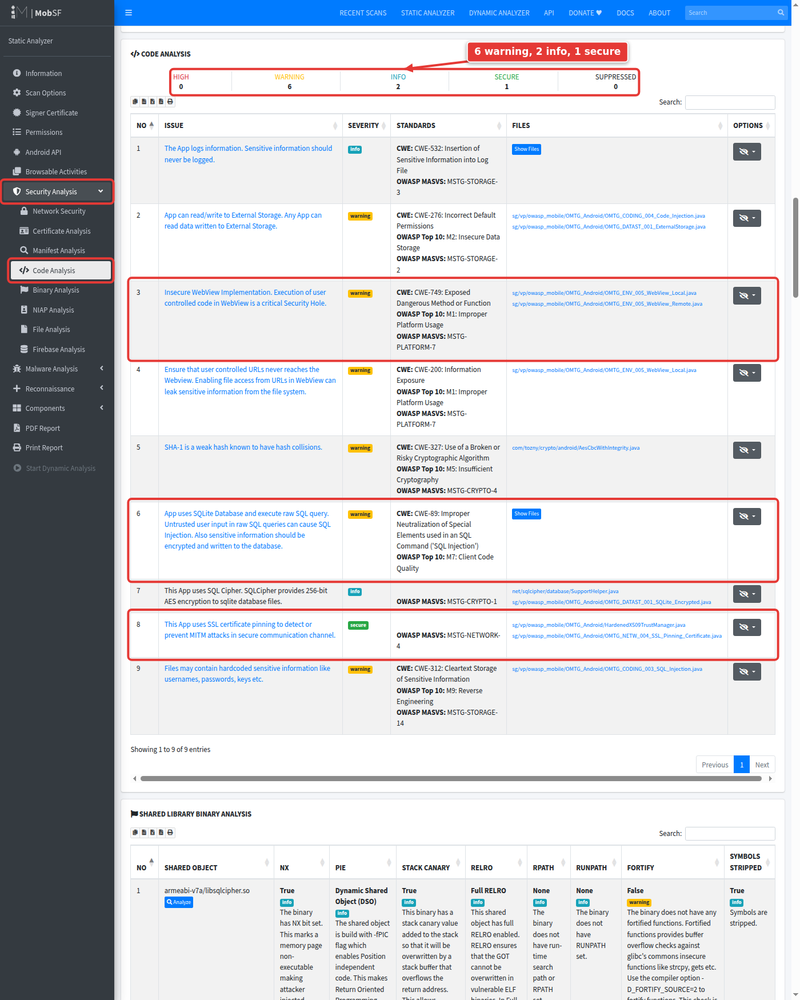

This is MobSF's rule-based code scan of the decompiled Java. For the MASTG app you should see these nine findings (the `ISSUE` column, shortened):

| Severity | Finding |
| --- | --- |
| warning | Insecure WebView Implementation |
| warning | Ensure that user controlled URLs never reaches the Webview (file access from URLs enabled) |
| warning | App uses SQLite Database and execute raw SQL query |
| warning | Files may contain hardcoded sensitive information |
| warning | SHA-1 is a weak hash known to have hash collisions |
| warning | App can read/write to External Storage |
| info | The App logs information |
| info | This App uses SQL Cipher |
| secure | This App uses SSL certificate pinning |

Every one of these needs manual validation. Open the flagged file and ask: does user-controlled input actually reach this code? A raw SQL query that only uses constants is not SQL injection.

Note the `secure` finding for SSL pinning. You will need to bypass that in the dynamic labs before Burp can see the app's traffic.

## Step 8: Reconnaissance ##

Open the menu and expand `Reconnaissance`.

### URLs ###

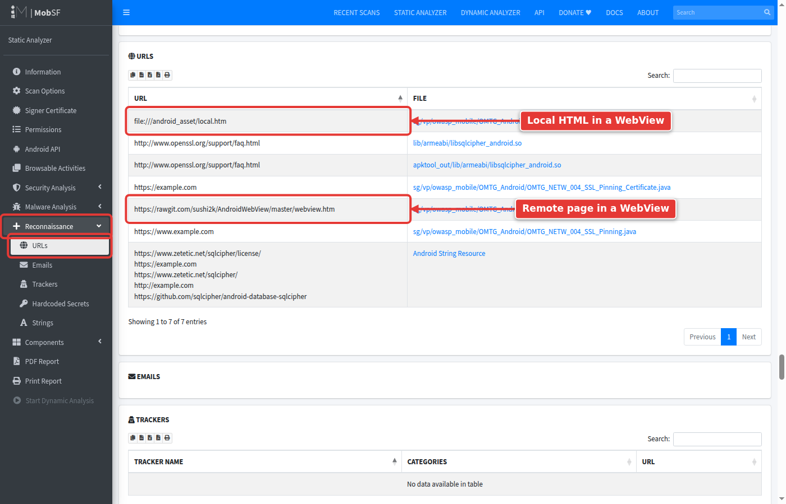

This shows URLs found in the code. It tells you where the app connects and what else it loads. In the MASTG app, note:

 * `https://rawgit.com/sushi2k/AndroidWebView/master/webview.htm`: remote content loaded into a WebView.
 * `file:///android_asset/local.htm`: local HTML loaded from the app's assets. Combined with the WebView findings in Step 7, this is worth a closer look.

### Hardcoded Secrets ###

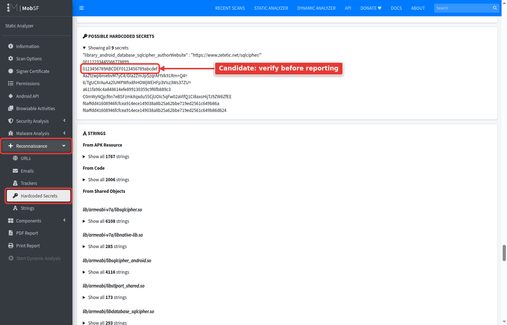

MobSF pulls candidate secrets out of the app's resource strings and decompiled code using patterns and entropy. Most results are **candidates, not findings**. For the MASTG app you will see values such as `0123456789ABCDEF0123456789abcdef` and several base64 strings.

For each candidate, search for it in the decompiled source and work out what it is used for. A key used to encrypt data on the device is a real finding; a test vector or a public identifier is not. **Verify before you report.**

### Strings ###

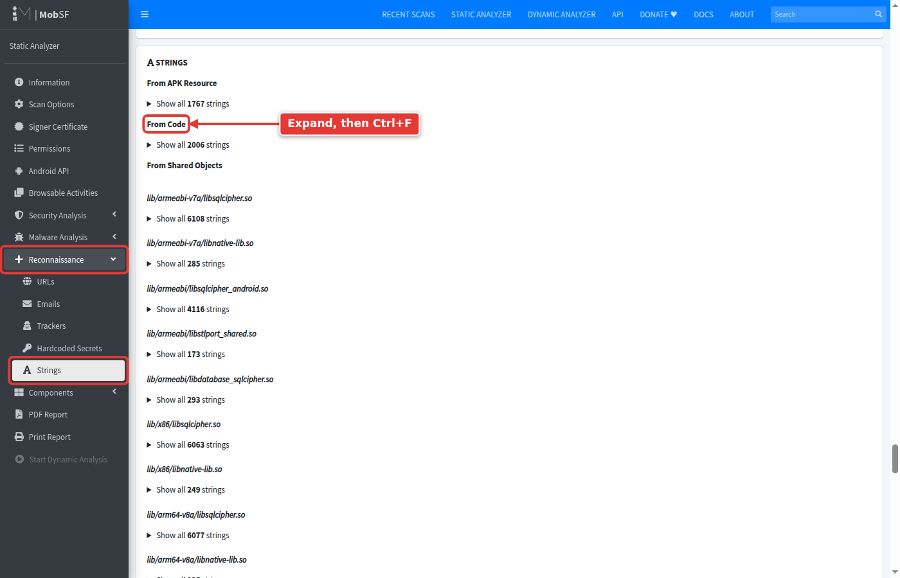

The raw strings from resources, native libraries, and code. Use your browser's search (Ctrl+F) here for words like `password`, `key`, `token`, `http`, and `admin`.

## Step 9: Browsable Activities ##

Open the menu and select `Browsable Activities`.

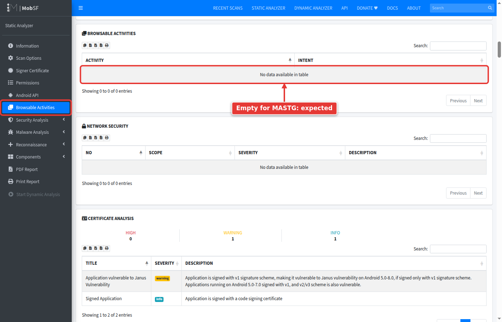

These are activities a web browser can open through a link (deep links). They matter because an attacker can trigger them from a web page or a message. When an app has them, MobSF lists the activity with its schemes, hosts, and paths. Note them down; in the dynamic labs you will trigger each one with:

`adb shell am start -a android.intent.action.VIEW -d "scheme://host/path"`

The MASTG app has **no** browsable activities, so this section is empty. That is expected.

## Step 10: Certificate ##

There are two places to look.

`Signer Certificate` (in the menu) shows the signing certificate details and which APK signature schemes (v1, v2, v3) the app is signed with.

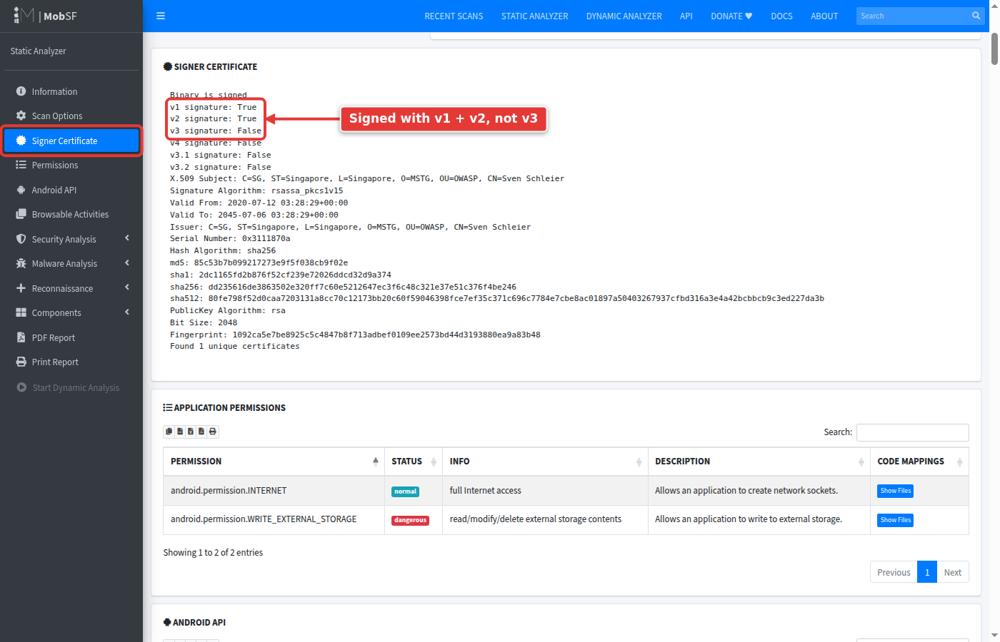

`Security Analysis -> Certificate Analysis` shows problems MobSF found with the signing. For the MASTG app you should see **Application vulnerable to Janus Vulnerability**.

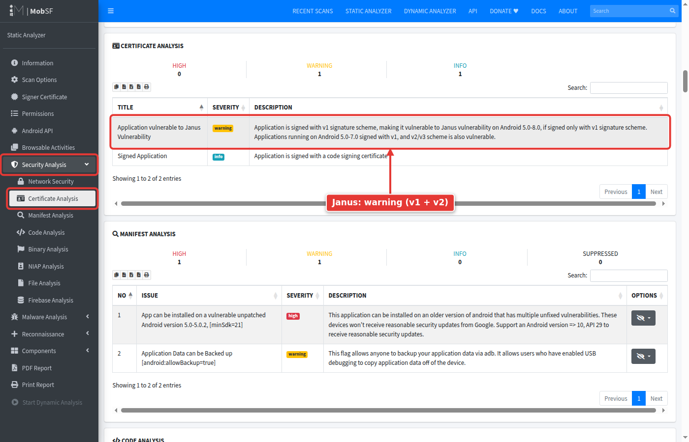

Janus (CVE-2017-13156) lets an attacker inject code into an APK without breaking a **v1** (JAR) signature. It was fixed in the December 2017 Android security patch. Whether it matters for a given app depends on two things you can read from this report:

 * **Signing schemes** (from `Signer Certificate`): Android 7.0 and later verify the v2/v3 signature when one is present. The MASTG app is signed with **v1 and v2**, so it is only exposed on Android 5.0 to 6.0, which do not check v2. An app signed with **v1 only** is exposed on Android 5.0 to 8.0.
 * **minSdk** (from `Information`): the MASTG app has minSdk 21, so it installs on Android 5.0 and the exposure is real, if narrow.

This is why MobSF rates Janus as `warning` for the MASTG app but `high` for InsecureBankv2 in the challenge below. When you report it, state the affected Android versions and, if relevant, their current market share.

## Step 11: Save Your Report ##

Use `PDF Report` or `Print Report` in the menu to keep a copy of the report with your notes.

## Challenge: The Empty Report ##

Scan the **InsecureBankv2** app, a well-known intentionally vulnerable banking app. Download it from:

https://raw.githubusercontent.com/dineshshetty/Android-InsecureBankv2/master/InsecureBankv2.apk

The manifest side is full of findings: exported activities, an exported receiver and provider, `debuggable=true`, and StrandHogg 2.0 warnings. But look at `Code Analysis`, `Android API`, and `URLs`.

1. What is strange about those sections?
2. Why did it happen? (Hint: look at the package name, then think about which code MobSF would want to skip to reduce noise.)
3. How would you still review the app's code?

Bonus: MobSF reports that the `PostLogin` activity is exported. Open `View AndroidManifest.xml` from the `DECOMPILED CODE` card and find it.

4. What screen do you think `PostLogin` is, and what could another app on the phone do because it is exported?
5. Write down the `adb` command you would use to test your theory.

Optional, on your emulator: test it. InsecureBankv2 targets Android 5.1 (API 22). Android 14 refuses to install apps that target below API 23, and Android 15 (the Pixel 9 emulator) refuses anything below API 24, so a plain `adb install` fails with `INSTALL_FAILED_DEPRECATED_SDK_VERSION`. Pass `--bypass-low-target-sdk-block` to install it anyway:

`adb install --bypass-low-target-sdk-block InsecureBankv2.apk`
`adb shell am start -n com.android.insecurebankv2/.PostLogin`

>[!NOTE]
>Because the app targets such an old API level, the first launch shows Android's `Choose what to allow InsecureBankv2 to access` screen instead of the app. Tap `CONTINUE`, then run the `am start` command again (Android blocks the pending launch after that screen). Android may also show a `This app was built for an older version of Android` dialog on top of the app; tap `OK`.

If the post-login screen (`Transfer`, `View Statement`, `Change Password`) opens without you ever logging in, you have confirmed an authentication bypass using nothing but the report and one command.

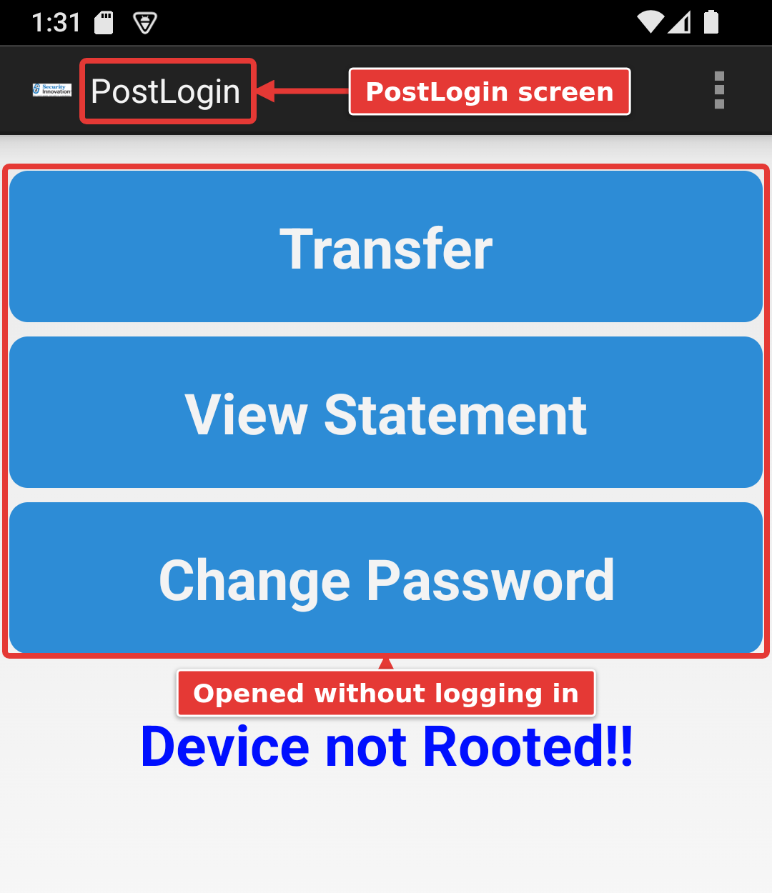

## Summary ##

| MobSF Section | Attacker Perspective | Defender Perspective |
| --- | --- | --- |
| Exported Components | Entry points reachable from other apps via `am` and `content` | Set `android:exported="false"` unless needed; protect the rest with permissions |
| Manifest Analysis | `debuggable`, `allowBackup`, old minSdk make runtime attacks easier | Disable debug in release, restrict backups, raise minSdk |
| Permissions | Shows what data the app can reach if compromised | Request only what the feature needs |
| Android API / Code Analysis | Points to WebView, SQL, crypto, and dynamic code for manual review | Fix validated findings; tune false positives |
| URLs / Secrets / Strings | Backend endpoints, keys, and credentials to test | Keep secrets server-side, never in the APK |
| Browsable Activities | Deep links triggerable from a web page | Validate all deep link input |
| Certificate | Janus and weak signing schemes | Sign with v2/v3, not v1 only |

### Your Findings ###

Copy this table into your notes and fill it in for each app you scan (MASTG, InsecureBankv2, and TheHackerBank later in the class). You will reuse it in the dynamic analysis labs.

| # | Section | Finding | Validated? (Y/N) | Follow-up for dynamic testing |
| --- | --- | --- | --- | --- |
| 1 | | | | |
| 2 | | | | |
| 3 | | | | |

***

<b><i>Continuing the course?  [Next Lab](/Labs/LAB_04_Burp_Proxy_Setup/burp-proxy-setup.md)</i></b>

<b><i>Want to go back?  [Previous Lab](/Labs/LAB_02_APK_Extraction/instructions.md)</i></b>

<b><i>Looking for a different lab?  [Lab Directory](/navigation.md)</i></b>

