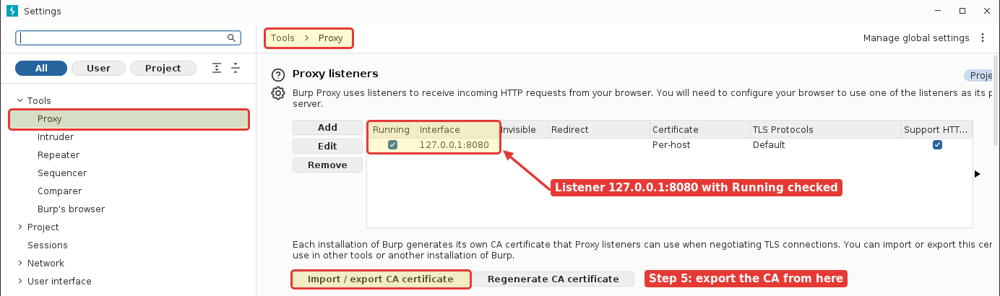
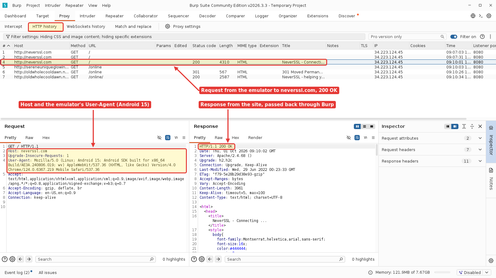
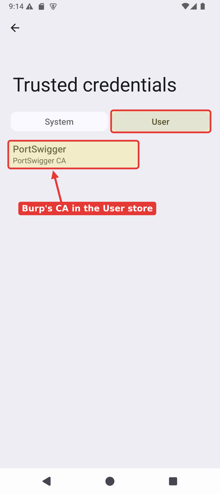

# Install, Set Up, and Use Burp Proxy

Burp Suite sits between the app and the internet so you can watch, pause, and change the traffic an app sends. In this lab you install Burp on the VM, point the Pixel_9 emulator's traffic through it, and install Burp's certificate on the device so you can start working with HTTPS as well as HTTP.

By the end you will see the emulator's web traffic appear in Burp's HTTP history. Full HTTPS interception for every app needs Burp's CA in the **system** trust store, which is the next lab; this lab gets the proxy working, captures HTTP, installs the CA to the **user** store, and explains the gap.

Start the emulator from terminal:

```bash
cd ~/Android/Sdk/emulator/
./emulator -avd Pixel_9
```

## Step 1: Install and Start Burp

Open a terminal and run:

```bash
cd ~/Android/Sdk/emulator/
wget -O burp.sh "https://portswigger.net/burp/releases/download?product=community&type=Linux"
file burp.sh          # should say "POSIX shell script executable", not "HTML document"
chmod +x burp.sh
./burp.sh -q
~/BurpSuiteCommunity/BurpSuiteCommunity &
```

The first time Burp starts:

1. A **Terms and Conditions** window appears. Read it and click **I Accept**.
2. A **New release ready to install** pop-up may appear in the corner of the project window. Close it with the **X** (or click **Update on next restart**); the lab works on the version you just installed.
3. Leave **Temporary project in memory** selected, then **Next**.
4. Leave **Use Burp defaults** selected, then **Start Burp**.

## Step 2: Check Burp's Proxy Listener

Burp listens on `127.0.0.1:8080` by default, and that is all we need. Confirm it:

Go to **Proxy -> Proxy settings**. A **Settings** window opens at **Tools -> Proxy**. Under **Proxy listeners** you should see one entry, `127.0.0.1:8080`, with **Running** checked.



Leave it on the default. You do not need to bind it to a special interface the way the old Corellium lab did, because of how the emulator reaches your machine (Step 3 explains).

While you are on the **Proxy** tab, check that the **Intercept** sub-tab shows **Intercept off** (the default). If intercept is on, every request from the device waits for you to click Forward.

## Step 3: Point the Emulator at Burp

The emulator runs on your machine, and from inside the emulator the special address **`10.0.2.2`** always means "the host machine's localhost". So the device reaches Burp's `127.0.0.1:8080` as `10.0.2.2:8080`.

Set the device's global HTTP proxy with adb:

```bash
adb shell settings put global http_proxy 10.0.2.2:8080
```

```bash
adb shell settings get global http_proxy      # should print 10.0.2.2:8080
```

That is the quickest method and does not depend on the image. Step 7 shows how to undo it.

>[!NOTE]
>GUI alternative: on the device, **Settings -> Network & internet -> Internet**, tap the gear next to **AndroidWifi**, tap the **pencil** (Modify) icon at the top right, open **Advanced options**, set **Proxy** to **Manual**, host `10.0.2.2`, port `8080`, **Save**. This is a per-Wi-Fi setting, separate from the adb global proxy above: while the adb proxy is set, this screen still shows Proxy **None**. Use one method, not both.

## Step 4: Capture Plain HTTP

Prove the proxy path works before touching certificates. HTTP needs no trust, so it should appear immediately.

The Pixel_9 AOSP image has **no Chrome**. Its only browser is **WebView Browser Tester** (package `org.chromium.webview_shell`). Open an **http** site in it, for example `http://neverssl.com`. You can type it in the app's address bar and tap **>**, or open it from the terminal:

```bash
adb shell am start -a android.intent.action.VIEW -d http://neverssl.com
```

Back in Burp, go to **Proxy -> HTTP history**. You should see `GET /` to `http://neverssl.com` with status `200` and title **NeverSSL - Connecting ...**, followed by requests to a random `*.neverssl.com` host for `/online` (that is neverssl redirecting itself). Click a row to see the full request and response.

>![IMPORTANT]
>If the requests don't all appear on burp, press the **>** button on the emulator
>
>




If you see it, the proxy is working. If not, jump to Troubleshooting.

## Step 5: Install Burp's CA Certificate (User Store)

To decrypt HTTPS, Burp presents its own certificate to the device, and the client only accepts it if it trusts Burp's CA. Burp makes one per install; you need to put it on the device.

1. Export the CA from Burp and push it to the device:

    In Burp: **Proxy -> Proxy settings -> Import / export CA certificate -> Export: Certificate in DER format -> Next**, type `/home/ubuntu/BurpCA.der` (or use **Select file ...**), **Next**, then **Close**.

    ```bash
    adb push ~/BurpCA.der /sdcard/Download/BurpCA.cer
    ```

>[!NOTE]
>With the proxy set, the device browser can also open **`http://burp`**, which shows a Burp welcome page with a **CA Certificate** link. On this image the WebView Browser Tester does **not** download the file when you tap it, so use the export and `adb push` above.

2. Install it: **Settings -> Security & privacy -> More security & privacy -> Encryption & credentials -> Install a certificate -> CA certificate**.

>[!NOTE]
>This menu path moves between Android versions; the one above is Android 15 (API 35). If you cannot find it, search the Settings app for "certificate" and pick **Install a certificate -> CA certificate**.

3. A **Your data won't be private** warning appears. Tap **Install anyway**.
4. The file picker opens on **Recent** and may say **No items**, because a file pushed with adb is not listed there. Tap the **menu** (three lines, top left) -> **Downloads**, then tap **BurpCA.cer**. On an emulator with no screen lock it installs straight away; if you have a PIN set, you are asked for it.
5. Confirm it landed in the user store: **Settings -> Security & privacy -> More security & privacy -> Encryption & credentials -> Trusted credentials -> User** tab. You should see **PortSwigger** (**PortSwigger CA**) listed.



## Step 6: What the User Store Does and Does Not Get You

>[!IMPORTANT]
>Since Android 7.0 (API 24), apps that target API 24 or higher **ignore** user-installed CA certificates by default. An app only trusts the user store if its network security config explicitly opts in. So installing the CA to the user store is not enough to intercept most apps' HTTPS.

Test it: on the device, open `https://example.com` in the WebView Browser Tester, then look at Burp's HTTP history.

On this image, the page **loads and Burp decrypts it**: you see `https://example.com`, a tick in the **TLS** column, status `200`, title **Example Domain**. That is not a contradiction. WebView Browser Tester is a test app whose network security config opts in to user CAs (`<certificates src="user"/>`), so it is one of the few apps that trusts the user store. Most real apps do not.

When a client does **not** trust Burp's CA, the request does not decrypt. Instead, Burp's **Event log** (bottom left of the Burp window) shows an error that starts like this:

```text
The client failed to negotiate a TLS connection to <host>:443: (certificate_unknown) Received fatal ...
```

You will likely already see one for the emulator's own background connection to `update.googleapis.com`, which does not trust Burp's CA. That failure is expected and is the whole reason for the next lab.

To make apps that ignore the user store trust Burp, the CA has to go in the **system** trust store, which needs root and is covered in the next lab. This lab leaves you with a working proxy, captured HTTP, and the CA staged in the user store.


## Summary

| Step | What it does |
| --- | --- |
| `10.0.2.2` | The emulator's alias for the host's localhost, so the device reaches Burp on 127.0.0.1:8080 |
| `settings put global http_proxy` | Routes the device's traffic through Burp in one adb command |
| HTTP history | Plain HTTP appears with no trust needed; the proof the proxy works |
| User-store CA | Needed but not sufficient; apps targeting Android 7.0+ ignore it unless they opt in |
| System-store CA (next lab) | What lets you decrypt HTTPS from apps that ignore the user store |

***

<b><i>Continuing the course? </br>[Next Lab](/Labs/LAB_05_Import_Burp_Certificate_To_System_Trust_Store/burp-proxy-system-cert-trust.md)</i></b>

<b><i>Want to go back? </br>[Previous Lab](/Labs/LAB_03_MobSF_Live/instructions.md)</i></b>

<b><i>Looking for a different lab? </br>[Lab Directory](/navigation.md)</i></b>

