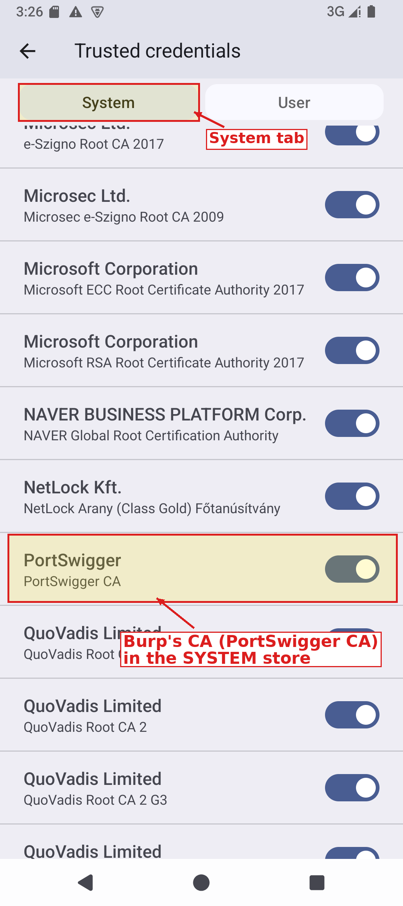
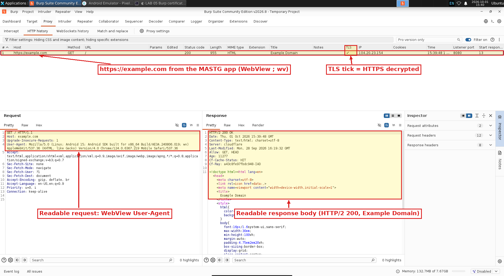

# Import Burp's Certificate to the System Trust Store

In the Burp proxy lab you put Burp's CA in the **user** store and saw the limit: most apps ignore user-installed CAs, so their HTTPS stayed opaque (you likely saw TLS errors in Burp's Event log for the emulator's own background connections). This lab puts Burp's CA in the **system** store, which those apps trust, so Burp can decrypt their HTTPS too.

On the Pixel_9 (Android 15 / API 35) this is more involved than it used to be. Read the next box before you start.

>[!IMPORTANT]
>**Android 14 changed where system CAs live.** They used to be plain files in `/system/etc/security/cacerts/`. Since Android 14 (API 34) the trust store is served from the **Conscrypt APEX** at `/apex/com.android.conscrypt/cacerts`, which is read-only and immutable, so a simple push into `/system` does nothing. The method below gets around that with a temporary overlay. Two consequences:
>
> * You need **root** (`adb root`), so an **AOSP / Google APIs** image, not Google Play.
> * The overlay is **not persistent**. A reboot (`adb reboot`) or a cold boot wipes it, and then you re-run Step 3. Closing the emulator window and starting it again is **not** a reboot: the emulator saves a Quick Boot snapshot on exit and resumes it, overlay included.

>[!NOTE]
>Burp generates its CA once per installation. If you reinstalled Burp since the last lab, export the current CA now; an old cert will not match and HTTPS will still fail. Burp's automatic updates keep the same CA.

## Step 1: Start the Emulator Writable and Get Root

Shut the emulator down if it is running, then start it with `-writable-system`:

```bash
cd ~/Android/Sdk/emulator/
./emulator -avd Pixel_9 -writable-system
```

Leave it running. Wait until the home screen is up, then in a new terminal:

```bash
cd ~/Android/Sdk/emulator/
adb root
adb shell getprop ro.build.version.sdk     # expect 35
adb shell getprop ro.build.version.release  # expect 15
```

`adb root` should print `restarting adbd as root`, or `adbd is already running as root` if the emulator resumed a snapshot where root was already on. Either is fine. If it says it cannot run as root in production builds, your AVD is a Google Play image; use a Google APIs / AOSP image instead.

## Step 2: Prepare the Certificate

Android names each system CA file after a hash of its subject, with a `.0` extension. Convert Burp's CA to PEM if needed, compute the hash, and build the file:

```bash
## convert DER to PEM if your export is DER
openssl x509 -inform DER -in ~/BurpCA.der -out ~/BurpCA.pem

HASH=$(openssl x509 -inform PEM -subject_hash_old -in ~/BurpCA.pem | head -1)
echo "filename will be ${HASH}.0"
cp ~/BurpCA.pem ~/${HASH}.0
openssl x509 -inform PEM -text -fingerprint -in ~/BurpCA.pem >> ~/${HASH}.0
adb push ~/${HASH}.0 /data/local/tmp/${HASH}.0
```

The hash is different for every Burp installation (for example `9a5ba575`), so yours will not match anyone else's. Keep `HASH` set in this terminal; Step 3 and Troubleshooting use it.

## Step 3: Overlay the System Store (the APEX method)

The idea: copy the existing system certificates into a writable temp directory, add Burp's, mount that over `/system/etc/security/cacerts` as a temporary filesystem, then bind-mount it into the places running apps actually read from, including the Conscrypt APEX and the Zygote process that every app is forked from.

You do this from a root shell **on the device**. Open one:

```bash
adb shell
```

The prompt now ends in `#`, which means you are root on the emulator. Everything until `exit` below runs on the device, not on your machine.

1. The device shell does not know the `HASH` you set on your machine in Step 2, so set it again here. Use **your** hash from Step 2's `echo` line:

```bash
HASH=9a5ba575
```

2. Copy the current system certificates out of the read-only APEX into a writable folder:

```bash
mkdir -p -m 755 /data/local/tmp/ca-copy
cp /apex/com.android.conscrypt/cacerts/* /data/local/tmp/ca-copy/
```

3. Mount an empty in-memory filesystem (tmpfs) over the old system CA folder, then fill it with the stock certificates plus Burp's:

```bash
mount -t tmpfs tmpfs /system/etc/security/cacerts
cp /data/local/tmp/ca-copy/* /system/etc/security/cacerts/
cp /data/local/tmp/$HASH.0 /system/etc/security/cacerts/
```

4. Give every file the owner, permissions and SELinux label Android expects for system CAs:

```bash
chown root:root /system/etc/security/cacerts/*
chmod 644 /system/etc/security/cacerts/*
chcon u:object_r:system_security_cacerts_file:s0 /system/etc/security/cacerts/*
```

5. Bind-mount the new folder over the APEX trust store. This changes what this shell sees:

```bash
mount --bind /system/etc/security/cacerts /apex/com.android.conscrypt/cacerts
```

6. Do the same bind inside the Zygote process's mount namespace. Every app is forked from Zygote, so apps launched **after** this see Burp's CA:

```bash
for z in $(pidof zygote) $(pidof zygote64); do
  nsenter --mount=/proc/$z/ns/mnt -- \
    mount --bind /system/etc/security/cacerts /apex/com.android.conscrypt/cacerts
done
```

None of these commands print anything when they work. If any line prints an error, stop and see Troubleshooting. On the x86_64 Pixel_9 image only `zygote64` exists (no 32-bit `zygote`), so the loop runs once.

7. Quick check, then leave the device shell:

```bash
ls /apex/com.android.conscrypt/cacerts | wc -l
exit
```

The count should be one more than before. On the Pixel_9 image that is `146` (145 stock certificates + Burp's).

Back on your machine (where `HASH` is still set from Step 2), confirm the cert and the Zygote bind:

```bash
adb shell ls -lZ /apex/com.android.conscrypt/cacerts/${HASH}.0
adb shell 'grep cacerts /proc/$(pidof zygote64)/mountinfo'
```

The first should show `-rw-r--r-- 1 root root u:object_r:system_security_cacerts_file:s0` and the file. The second should list a `tmpfs` mount on `/apex/com.android.conscrypt/cacerts`. That line means the bind reached Zygote.

This is an overlay in memory, not a change to the real image. Do **not** reboot after this step: a reboot wipes the overlay. If you do reboot, repeat Step 3 (the cert you pushed in Step 2 is still in `/data/local/tmp`).


## Step 4: Verify the Cert Is in the System Store

Apps that were already running before Step 3 (Settings and the KeyChain service behind it are among them) still see the old store. Restart both first:

```bash
adb shell am force-stop com.android.settings
adb shell am force-stop com.android.keychain
```

Then on the device: **Settings -> Security & privacy -> More security & privacy -> Encryption & credentials -> Trusted credentials -> System** tab, then scroll to **PortSwigger** (listed alphabetically, between NetLock and QuoVadis, as PortSwigger / PortSwigger CA).

>[!NOTE]
>Encryption & credentials is in the **Security** section near the bottom of More security & privacy; scroll down to see it. If you cannot find the menu, search the Settings app for "trusted credentials".

>[!TIP]
>If PortSwigger is missing, you skipped the force-stop. Settings was opened before the overlay and still reads the old store.



## Step 5: Intercept HTTPS From an App That Ignores the User Store

The WebView Browser Tester from the last lab trusts the user store, so it is not a fair test here. You need a client that trusts **only** the system store, which is what almost every real app does. This lab uses the **MASTG Hacking Playground** (`MSTG-Android-Java.apk`, the app you scanned in the MobSF lab). It targets API 28 and has no network security config, so by Android's default it trusts **system CAs only** and ignores the user store. It also does not pin its certificate on the screen used below.

1. Make sure Burp is running with Intercept off, and re-apply the proxy (it may have reset when you restarted the emulator):

```bash
adb shell settings put global http_proxy 10.0.2.2:8080
```

2. Install the app **after** Step 3, then open it [You can download from the repo](https://github.com/doergestim/Revamped-Android-Labs/blob/main/New%20Labs/Lab5%20-%20Importing_Certificate_to_System_Trust_Store/MSTG-Android-Java.apk):

```bash
adb install MSTG-Android-Java.apk
```

   On the device, open **Attack me if u can**, scroll down, and tap **OMTG_NETW_001_SECURE_CHANNEL**. The screen loads two pages:
    * **1. Insecure web page** (`http://example.com`) shows *Webpage not available ... net::ERR_CLEARTEXT_NOT_PERMITTED*. That is expected: apps targeting API 28+ block plain HTTP by default, so it never reaches Burp.
    * **2. Secure web page** (`https://example.com`) shows the Example Domain page. That request went through Burp.

   For comparison: if you open the same screen **before** Step 3, panel 2 stays blank and Burp's **Event log** shows `The client failed to negotiate a TLS connection to example.com:443: (certificate_unknown) Received fatal alert: certificate_unknown`. That happens even though Burp's CA is still in the user store from the last lab, which proves the app ignores the user store.

3. In Burp -> **Proxy -> HTTP history**, you should see `https://example.com` `GET /` `200`, title **Example Domain**, with a tick in the **TLS** column. Click it: the request shows the app's WebView User-Agent (it ends in `; wv)`), and the response shows the readable HTML. Burp decrypted HTTPS from an app that only trusts the system store.



>[!NOTE]
>Apps that use **certificate pinning** will still refuse Burp's certificate even from the system store. That is a separate problem, usually solved at runtime with Frida (see the root detection lab for the same hooking technique).

## Step 6: Clean Up (optional)

Remove the proxy so later work is not routed through a closed Burp, and close the test app (an app that is already running keeps using the old proxy until it is stopped):

```bash
adb shell settings put global http_proxy :0
adb shell am force-stop sg.vp.owasp_mobile.omtg_android
```

The system-store overlay is temporary, but closing the emulator does not remove it (Quick Boot resumes it). To remove it, reboot the device:

```bash
adb reboot
```

After the reboot, the System tab no longer lists PortSwigger.

## Summary ##

| Step | Why |
| --- | --- |
| Android 14+ moved the store to the Conscrypt APEX | A plain push to `/system/etc/security/cacerts` no longer works |
| tmpfs overlay + bind into APEX and Zygote | Makes the system trust store writable in memory so apps pick up Burp's CA |
| `<subject_hash_old>.0` filename, 644, SELinux label | Android looks CAs up by hashed name and requires the right perms and label |
| Restart Settings / KeyChain / test app | Only processes started after the overlay see it |
| Not persistent | `adb reboot` or a cold boot wipes the overlay (re-run Step 3); a Quick Boot resume keeps it |
| System store | Apps that ignore the user store (like the MASTG app) now trust Burp, so their HTTPS decrypts (except pinned apps) |

***

<b><i>Continuing the course? </br>[Next Lab](/navigation.md)</i></b>

<b><i>Want to go back? </br>[Previous Lab](/Labs/LAB_04_Burp_Proxy_Setup/instructions.md)</i></b>

<b><i>Looking for a different lab? </br>[Lab Directory](/navigation.md)</i></b>

