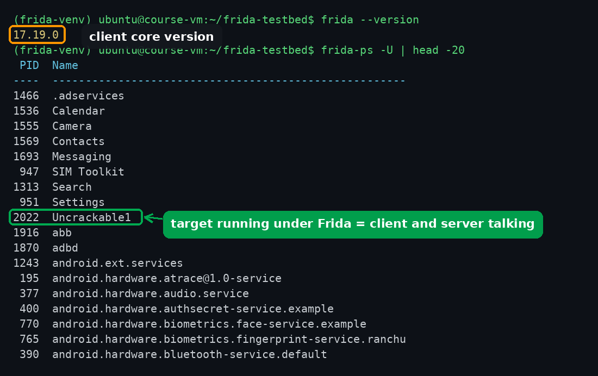
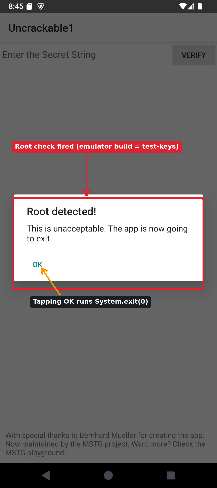
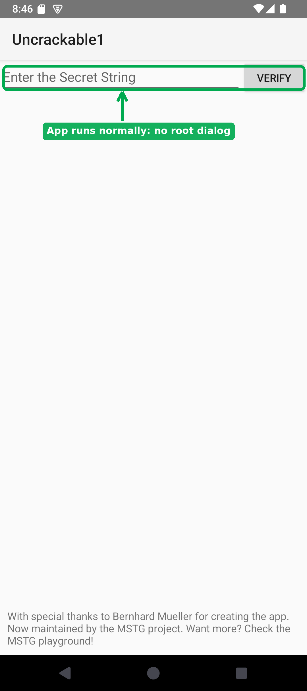

# Root Detection Bypass with Frida

Many apps refuse to run on a rooted phone or an emulator. They call it a security feature: on a compromised device an attacker can read the app's memory, hook its functions, and dump its secrets, so the app checks for signs of root and exits if it finds any.

As a tester, that check is the first thing standing between you and the app. In this lab you will make an app that quits on our emulator run anyway, by hooking its root check at runtime with **Frida**. Nothing about the app on disk changes; we only change what its code returns while it runs.

Target: **OWASP UnCrackable-Level1**, a small open-source crackme built for exactly this.

## How Root Detection Works

There is no single "am I rooted?" call in Android, so apps stack up cheap heuristics and trip if any one fires. Common checks:

 * An `su` binary somewhere on `PATH`.
 * Superuser management apps or their files (`Superuser.apk`, `daemonsu`, magisk paths).
 * The build is signed with **test-keys** instead of release-keys (`android.os.Build.TAGS`). **Emulator builds are signed with test-keys**, so this one check flags every stock emulator, rooted or not.
 * Writable system partitions, `ro.debuggable=1`, known root-cloaking hooks, and so on.

Each check is usually a method returning a boolean, and the app trips if any return `true`. That is the weakness we exploit: force those methods to return `false` and the app believes it is on a clean device.

## Step 1: Install Frida

Frida has two halves that must be the **same version**: a client on your machine (`frida-tools`) and a server that runs on the device (`frida-server`).

Install the client in a Python virtual environment so it does not touch your system Python:

```bash
python3 -m venv ~/frida-venv
source ~/frida-venv/bin/activate
pip install frida-tools
```

Check the version. Write down the number; you need the exact same one for the server:

```bash
frida --version
```

>[!NOTE]
>`frida --version` prints the Frida **core** version (for example `17.19.0`). That is the number that must match `frida-server`. The `frida-tools` package has its own, different version number; ignore it here.

## Step 2: Start the Emulator and Confirm Root

Start the Pixel_9 emulator (Android Studio, or straight from a terminal):

```bash
cd ~/Android/Sdk/emulator/
./emulator -avd Pixel_9
```

Leave that terminal running. In a **new** terminal, confirm adb sees the device and that you can get root:

```bash
cd ~/Android/Sdk/emulator/
adb devices
adb root
```

`adb root` should print `restarting adbd as root` (or say it is already root).

>[!IMPORTANT]
>If `adb root` prints `adbd cannot run as root in production builds`, your AVD uses a **Google Play** image. Frida-server needs root to run this way. Create an AVD with an **AOSP** or **Google APIs** image (see the setup lab) and use that one.

Find the device's CPU architecture. You need it to download the matching `frida-server`:

```bash
adb shell getprop ro.product.cpu.abi
```

On a typical Intel or AMD laptop this is `x86_64`. On an Apple-silicon Mac it is `arm64-v8a`.

## Step 3: Install frida-server on the Emulator 


Download the `frida-server` build that matches **both** your Frida version (Step 1) and your ABI (Step 2) from the Frida releases page: https://github.com/frida/frida/releases, make sure to click "Show More Assets", the server won't be at the very top

The file is named `frida-server-<version>-android-<abi>.xz`. For version `17.19.0` on an `x86_64` emulator that is `frida-server-17.19.0-android-x86_64.xz`. Map the ABI to Frida's name: `x86_64` -> `x86_64`, `arm64-v8a` -> `arm64`.

Decompress it, push it to the device, and run it:

```bash
mv ~/Downloads/frida-server-*-android-*.xz ./
unxz frida-server-*-android-*.xz
adb root
adb push frida-server-*-android-* /data/local/tmp/frida-server
adb shell "chmod 755 /data/local/tmp/frida-server"
adb shell "/data/local/tmp/frida-server &"
```

>[!NOTE]
>That last command holds the shell open while the server runs. Open another terminal for the next steps. If it exits immediately, re-run `adb root` first: the server needs root.

Back on your machine, confirm the client can talk to the server (`-U` means USB/local device):

```bash
cd ~/Android/Sdk/emulator/
```

```bash
frida-ps -U | head
```

A list of running processes means the two halves are talking.



## Step 4: Install the Target and Watch It Quit ##

Download UnCrackable-Level1:

```bash
wget -O UnCrackable-Level1.apk 'https://raw.githubusercontent.com/OWASP/owasp-mstg/master/Crackmes/Android/Level_01/UnCrackable-Level1.apk'
```

Install it and open it:

```bash
adb install UnCrackable-Level1.apk
adb shell monkey -p owasp.mstg.uncrackable1 -c android.intent.category.LAUNCHER 1
```

The app immediately shows **"Root detected! This is unacceptable. The app is now going to exit."** Tapping OK closes it. This is the check firing on the emulator's test-keys build. You cannot use the app at all yet.



## Step 5: Find the Check ##

You already scanned APKs with MobSF, so you know how to get the decompiled code. For this app the root logic is in class **`sg.vantagepoint.a.c`**, three static methods that each return a boolean:

| Method | What it checks |
| --- | --- |
| `a()` | an `su` binary on any `PATH` entry |
| `b()` | `Build.TAGS` contains `test-keys` (this is the one that fires on the emulator) |
| `c()` | known superuser files exist |

`MainActivity.onCreate()` runs `if (c.a() || c.b() || c.c())` and, if any is true, shows the dialog and exits. Because it is an OR, forcing **all three** to return `false` is the reliable fix.

## Step 6: Write the Bypass ##

Create `bypass.js`:

```bash
cat > bypass.js <<'EOF'
Java.perform(function () {
    var RootCheck = Java.use("sg.vantagepoint.a.c");
    ["a", "b", "c"].forEach(function (name) {
        RootCheck[name].implementation = function () {
            console.log("[bypass] sg.vantagepoint.a.c." + name + "() -> false");
            return false;
        };
    });
    console.log("[bypass] root checks hooked");
});
EOF
```

`Java.use` grabs the class; replacing each method's `.implementation` swaps in our version, which logs and returns `false`.

## Step 7: Run It ##

The check runs in `onCreate`, the instant the app starts, so we must hook it **before** the app runs, not after. `-f` tells Frida to **spawn** the app itself and inject the script first:

```bash
frida -U -f owasp.mstg.uncrackable1 -l bypass.js
```

You will see the `[bypass]` log lines, then the app opens to its normal screen with a text field, no "Root detected!" dialog. You have defeated the root check without modifying the APK.



To leave the Frida prompt, type `exit`.

>[!NOTE]
>Difference that matters: `-f <package>` **spawns** a fresh process with the script already in place. `frida -U <package>` (or `-n`) **attaches** to a process that is already running, which is too late for a check that runs at startup. Startup checks always need spawn.

## Challenge ##

1. **Read the secret.** UnCrackable-Level1 is really a crackme: type anything in the box and press VERIFY and it says "Nope...". The correct string is decrypted at runtime by `sg.vantagepoint.uncrackable1.a.a()`. Hook that method (or the AES call it uses) with Frida and print the value it compares against. What is the secret string?

2. **A cruder bypass.** Instead of the root methods, hook `java.lang.System.exit` to do nothing. Explain what the user sees with this approach versus the Step 6 approach, and why hooking the check itself is cleaner.

3. **Think like the defender.** Root detection that lives in easily hooked Java methods is weak. Name two things a developer could do to make this bypass harder, and say whether either actually stops an attacker with Frida or only slows them down.

## Summary ##

| Concept | Takeaway |
| --- | --- |
| Root detection | A stack of boolean heuristics; the app trips if any one fires |
| test-keys | Emulator builds are signed with test-keys, so that single check flags every emulator |
| Frida spawn vs attach | Startup checks must be hooked with `-f` (spawn), not by attaching afterward |
| The bypass | Replace the detection methods so they return `false`; the APK on disk is untouched |
| Defender view | Java-level checks only slow a determined attacker; move sensitive logic server-side |

***

<b><i>Continuing the course? </br>[Next Lab](/navigation.md)</i></b>

<b><i>Want to go back? </br>[Previous Lab](/navigation.md)</i></b>

<b><i>Looking for a different lab? </br>[Lab Directory](/navigation.md)</i></b>
