# Intent Manipulation

If your device isn't booted yet, launch it with the following, look at [Lab Setup](/New%20Labs/NewLab_Setup.md/#Launching%the%Device)

## Launching the Device

Start by opening a terminal:


Then run the following to launch Android Studio:

```bash
android-studio
```

Once it launches, you will see the following window.<br>
Click `More Actions` and then `Virtual Device Manager`.


Then, you will see the following window.<br>
Click the `Play` icon next to the `Pixel 9` device to power it on.


Behold! Your very own emulated Virtual Android!


## Setup

### Prerequisites
Before installing anything let's make prepared folder for all of the files.

```bash
cd ~/Android/Sdk
mkdir Intent_Manipulation
cd Intent_Manipulation
```
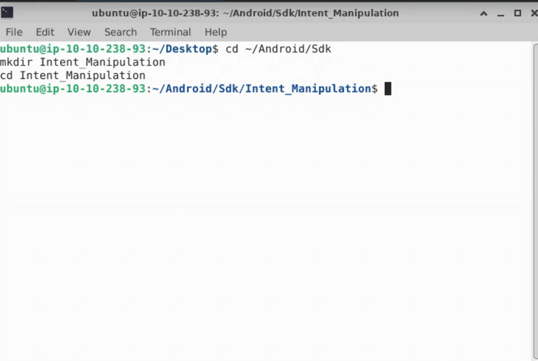

You will need to add jre so the apktool can work. Do it with this command in terminal.

```bash
sudo apt update
sudo apt install -y default-jre
```
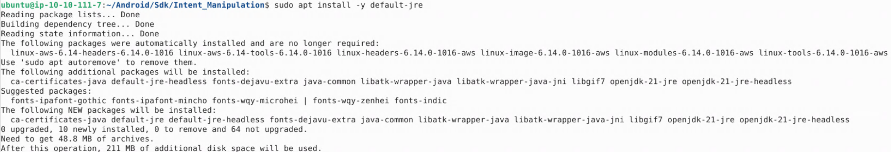
### Installing apktool

Apktool is a software used for decompiling and building again apk files.


> [!Note]
> 
> decompiling - taking the file that is ready to be put on the phone as an application and stripping it into file

The quickest way of installing it is on their official website:

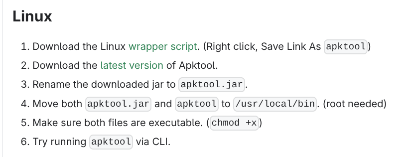

Let's download the necessary files:
``` bash
sudo wget -O /usr/local/bin/apktool.jar \
https://github.com/iBotPeaches/Apktool/releases/download/v2.12.0/apktool_2.12.0.jar
 
sudo wget -O /usr/local/bin/apktool \
https://raw.githubusercontent.com/iBotPeaches/Apktool/master/scripts/linux/apktool
```
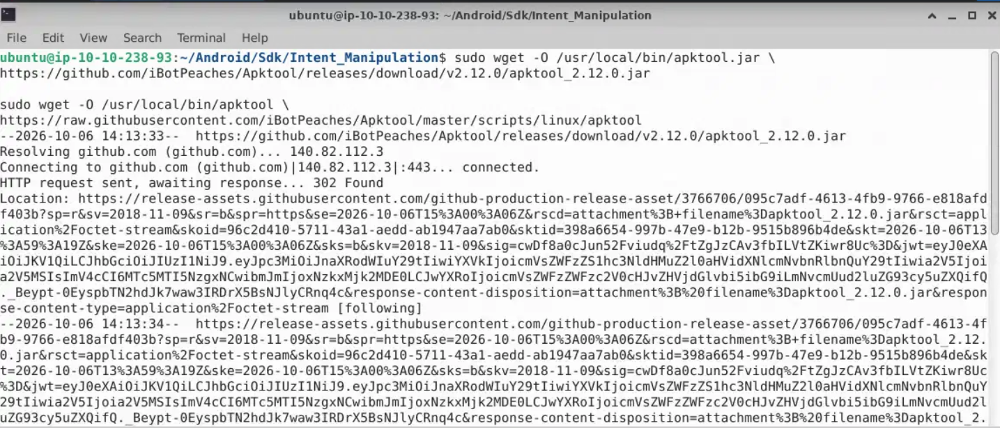

Now it is the time that we make both of the files executable. What it means is that we give a file execute permission, meaning the system is allowed to run it as a program or script.

``` bash
sudo chmod +x /usr/local/bin/apktool
sudo chmod +x /usr/local/bin/apktool.jar
```
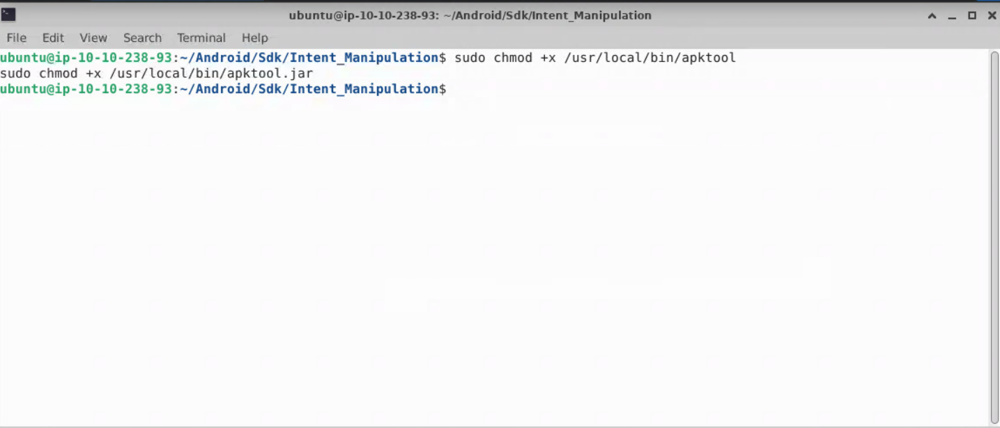

Now we try to open apktool in CLI (terminal).

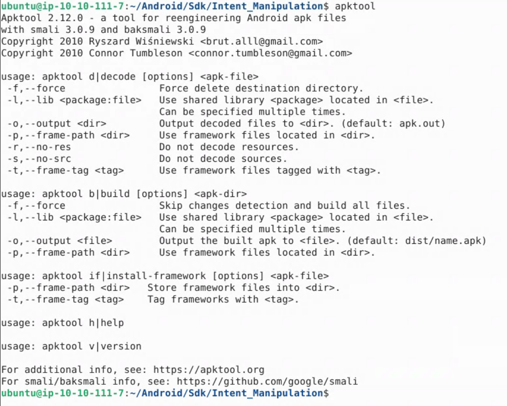

This is how you should see it.


> [!IMPORTANT] 
> 
> First, please download the following file.
> 
> https://github.com/doergestim/Revamped-Android-Labs/blob/main/tools/final.apk
>
> After, use the following command to install the apk into the emulated phone:
> ```bash
> adb install final.apk
> ```

## What is an intent?

In this lab we will be using "intents" to bypass access controls.

An "intent" is a "message object" typically used communicate between different activities in your application.

However, sometimes intents can be sent between applications. A legitimate example of this might be your camera accepting an intent from your banking app in order to take a photo of a check.

So in order to analyze intents on our device, we need to create a [manifest file](https://www.blackhillsinfosec.com/field-guide-to-the-android-manifest-file/).

Next, we need to run the following command:

```bash
apktool d final.apk
```

This command will take the `final.apk` file and decompress it (since it is a zip) into multiple different directories.

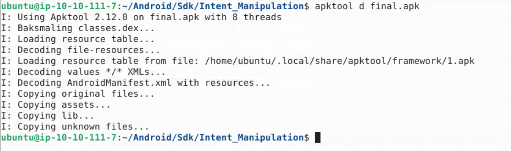

This allows us to go through and look at the `manifest.xml` file.

Once this process finishes, go ahead and navigate into the `final` directory and run `ls` to list the contents of the folder:

``` bash
cd ./final
ls
```
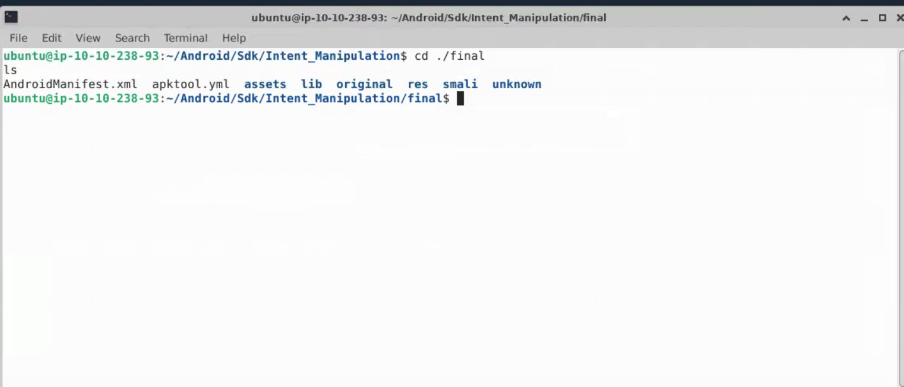
As you can see, we now have a file named `AndroidManifest.xml`. This is where we will be looking for the intents that we can access and manipulate.

Let's continue by running the following command:

```bash
less AndroidManifest.xml
```

Now we can press forward slash (`/`) to initiate a search of the output.

We want to search for activities, so let's type `activity` and hit `Enter`:

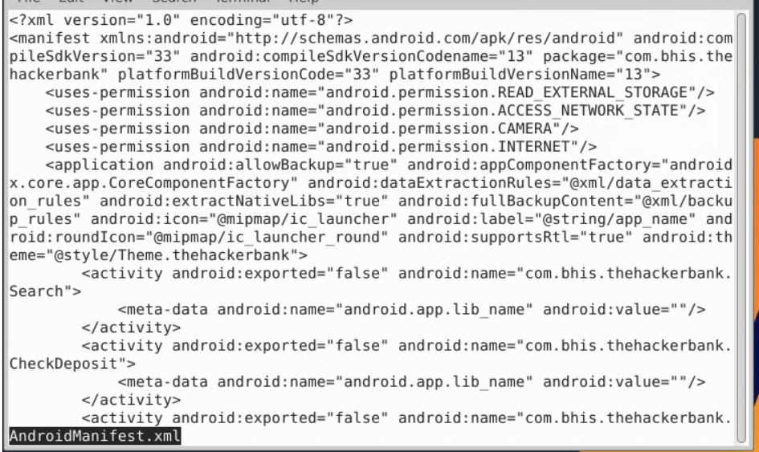

If done correctly, you should see this:

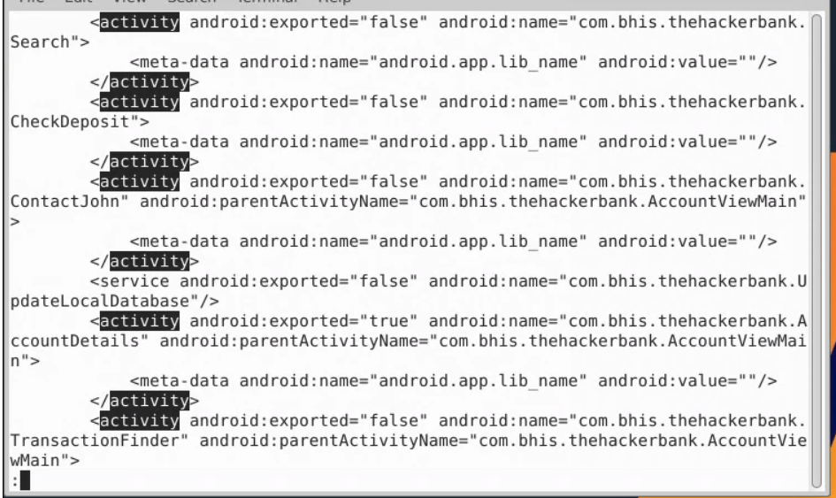

These are all of the exported activities. The following is an expansion of one of the entries to provide more context:

```
<activity
    android:name=".AccountDetails"
    android:parentActivityName=".AccountViewMain"
    android:exported="true">
        <meta-data
            android:name="android.app.lib_name"
            android:value="" />
</activity>
```

Things like searches, check deposits, etc., will all show up here, meaning that they are accessible to us.

This also means that the activity can be launched by a process outside of the application.

For our example, we will do this by using our best friend `adb`.

Before moving on, go ahead and press `Q` in the terminal to exit the `less` view.

## Invoking Intents from ADB

By using the adb shell, we can execute a specific activity within the app.

The following command executes the specified activity after the `-n` option.

`adb shell am start -n com.bhis.thehackerbank/.{ACTIVITY NAME}`

The name of each activity present in the application can be found in the [manifest file](https://www.blackhillsinfosec.com/field-guide-to-the-android-manifest-file/), but for this example, we will use the expanded entry from earlier:

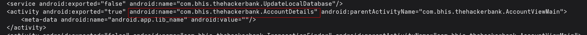

In the expanded entry, we see that the activity name is `.AccountDetails`, so we will substitute that into the above command and run it in our terminal:

```bash
adb shell am start -n com.bhis.thehackerbank/.AccountDetails
```

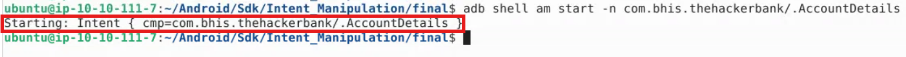

Shortly after making the command the app is starting our intent.

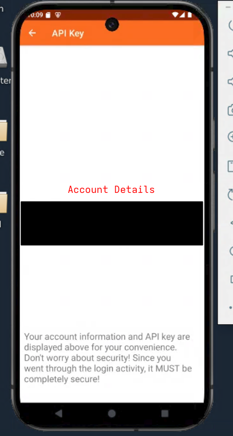

We can also pass data when starting intents with ADB. For example, running the below command results in a different result than running the command above.

```bash
adb shell am start -n com.bhis.thehackerbank/.AccountDetails --es "USER_COOKIE" "nothinginparticular"
```

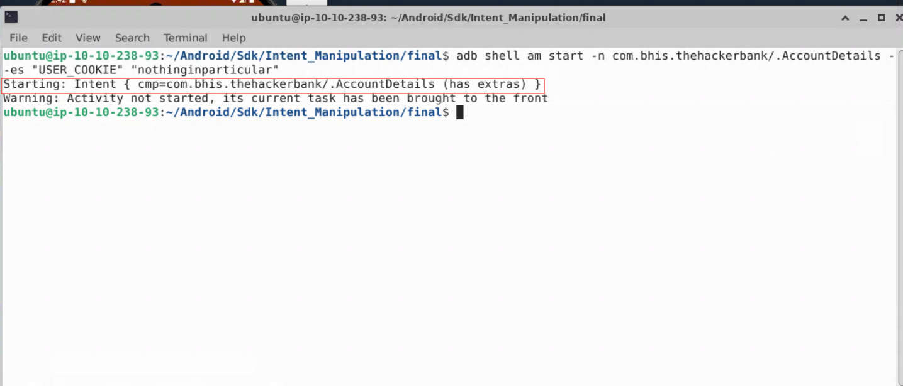

When executed correctly, the app will behave slightly differently and give us even more information, and you should something similar to the following:

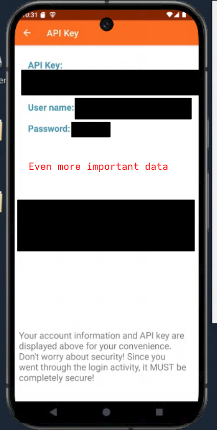

The second command requires us to know the name of the intent extra. These can be found by looking at the source code in a program such as `jadx`.

At this point, another thing to check is where you can go from here. With this application, pressing the back arrow will result in the application crashing.

However this is not always the case...

***Want to go back?  
[Previous Lab](https://github.com/doergestim/Revamped-Android-Labs/blob/main/Labs/LAB_06_Root_Detection_Bypass/instructions.md)***

***Looking for a different lab?  
[Lab Directory](https://github.com/doergestim/Revamped-Android-Labs/blob/main/navigation.md)***
